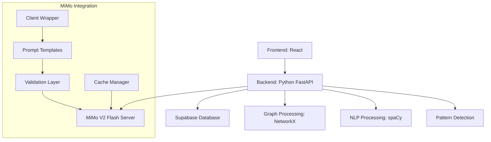

# Спецификация интеграции MiMo V2 Flash

## 1. Обзор MiMo V2 Flash

### 1.1 Характеристики модели

**Модель**: MiMo V2 Flash (Xiaomi)
**Тип**: Mixture-of-Experts (MoE)
**Всего параметров**: 309B
**Активных параметров**: 15B (на запрос)
**Контекст**: до 256K токенов
**Архитектура**: Hybrid Sliding Window Attention (SWA) + Global Attention (GA)
**Скорость генерации**: ~150 токенов/сек
**Лицензия**: Open Source (Hugging Face) <mcreference link="https://huggingface.co/XiaomiMiMo/MiMo-V2-Flash" index="1">1</mcreference>

### 1.2 Преимущества для научного анализа

1. **Эффективность инференса**:
   - 15B активных параметров на запрос
   - 3-кратное ускорение через Multi-Token Prediction (MTP)
   - 6-кратное сокращение KV-cache <mcreference link="https://dev.to/czmilo/xiaomi-mimo-v2-flash-complete-guide-to-the-309b-parameter-moe-model-2025-bg6" index="2">2</mcreference>

2. **Длинный контекст**:
   - Поддержка до 256K токенов
   - Идеально для анализа больших коллекций научных статей
   - Возможность связывать контекст из множества документов

3. **Высокое качество рассуждений**:
   - MMLU-Pro: 84.9% <mcreference link="https://huggingface.co/XiaomiMiMo/MiMo-V2-Flash" index="1">1</mcreference>
   - GPQA-Diamond: 83.7%
   - AIME 2025: 94.1%
   - SWE-Bench Verified: 73.4%

4. **Agentic capabilities**:
   - Поддержка tool calling
   - Multi-step reasoning
   - Кодогенерация для анализа данных

## 2. Технические требования к интеграции

### 2.1 Системные требования

**Минимальные требования**:
- CPU: 16+ cores
- RAM: 128GB+
- GPU: 2x A100 (40GB) или эквивалент
- Storage: 500GB+ SSD
- OS: Linux (Ubuntu 20.04+)

**Рекомендуемые требования**:
- CPU: 32+ cores
- RAM: 256GB+
- GPU: 4x A100 (40GB) или 8x A6000 (48GB)
- Storage: 1TB+ NVMe SSD
- Network: 10Gbps+

### 2.2 Программное обеспечение

**Backend (Python)**:
```bash
# SGLang для оптимальной производительности
pip install sglang==0.5.6.post2.dev8005+pr.15207.g39d5bd57a \
    --index-url https://sgl-project.github.io/whl/pr/ \
    --extra-index-url https://pypi.org/simple

# Дополнительные библиотеки
pip install transformers torch openai pydantic
```

**Запуск сервера**:
```bash
SGLANG_ENABLE_SPEC_V2=1 python3 -m sglang.launch_server \
    --model-path XiaomiMiMo/MiMo-V2-Flash \
    --served-model-name mimo-v2-flash \
    --pp-size 1 \
    --dp-size 2 \
    --enable-dp-attention \
    --tp-size 8 \
    --moe-a2a-backend deepep \
    --page-size 1 \
    --host 0.0.0.0 \
    --port 9001 \
    --trust-remote-code \
    --mem-fraction-static 0.75 \
    --max-running-requests 128 \
    --chunked-prefill-size 16384 \
    --reasoning-parser qwen3 \
    --tool-call-parser mimo \
    --context-length 262144 \
    --attention-backend fa3 \
    --speculative-algorithm EAGLE \
    --speculative-num-steps 3 \
    --speculative-eagle-topk 1 \
    --speculative-num-draft-tokens 4 \
    --enable-mtp
```

### 2.3 API интеграция

**Клиентский код (Python)**:
```python
import openai

class MiMoClient:
    def __init__(self, base_url="http://localhost:9001/v1"):
        self.client = openai.OpenAI(
            base_url=base_url,
            api_key="dummy-key"
        )
    
    async def analyze_article(self, article_text, prompt):
        response = await self.client.chat.completions.create(
            model="mimo-v2-flash",
            messages=[
                {
                    "role": "system",
                    "content": "You are an expert in biochemistry and scientific literature analysis."
                },
                {
                    "role": "user",
                    "content": prompt + "\n\nArticle:\n" + article_text
                }
            ],
            temperature=0.3,
            max_tokens=4096,
            stream=True
        )
        return response
```

## 3. Функциональные возможности для анализа

### 3.1 Анализ научных статей

**Извлечение сущностей**:
```python
EXTRACTION_PROMPT = """
Extract biochemical entities from the article. Return JSON with:
{
    "proteins": [{"name": "P53", "uniprot_id": "P04637", "function": "..."}],
    "genes": [{"symbol": "TP53", "ensembl_id": "ENSG00000141510"}],
    "metabolites": [{"name": "ATP", "pubchem_id": "5957"}],
    "interactions": [{"source": "P53", "target": "MDM2", "type": "inhibition"}]
}
"""
```

**Выявление взаимодействий**:
```python
INTERACTION_PROMPT = """
Identify biochemical interactions mentioned in the article. For each interaction, provide:
1. Interaction type (binding, inhibition, activation, modification)
2. Mechanism (if described)
3. Evidence level (experimental, computational, hypothetical)
4. Key references (if available)
Return as structured JSON.
"""
```

**Анализ Research Gaps**:
```python
RESEARCH_GAP_PROMPT = """
Analyze the article for research gaps. Identify:
1. Explicitly mentioned limitations
2. Areas requiring further investigation
3. Contradictions with existing literature
4. Potential novel hypotheses suggested
Prioritize gaps by potential impact and feasibility.
"""
```

### 3.2 Генерация гипотез

**Шаблон промпта**:
```python
HYPOTHESIS_GENERATION_PROMPT = """
Based on the analyzed articles and extracted biochemical interactions, generate novel hypotheses:

1. Identify indirect connections between entities
2. Find underexplored pathways
3. Propose mechanisms for observed phenomena
4. Suggest potential therapeutic targets

For each hypothesis, provide:
- Hypothesis statement
- Supporting evidence (with article references)
- Confidence score (0-1)
- Testable predictions
- Potential impact score (0-1)

Focus on hypotheses that are:
- Novel but plausible
- Based on solid biochemical principles
- Testable with current methods
- Could lead to significant scientific advances
"""
```

### 3.3 Автоматическое обобщение

**Абстракция информации**:
```python
SUMMARY_PROMPT = """
Generate a comprehensive summary of the analyzed articles:

1. Executive Summary (2-3 paragraphs)
2. Key Findings (bullet points)
3. Main Pathways Involved
4. Consensus vs Controversy
5. Future Directions
6. Key References

Maintain scientific accuracy while being concise.
Include confidence levels for uncertain statements.
"""
```

**Синтез знаний**:
```python
SYNTHESIS_PROMPT = """
Synthesize knowledge from multiple articles to create a coherent understanding:

1. Identify common themes
2. Resolve contradictions (if possible)
3. Integrate complementary findings
4. Highlight unique contributions
5. Propose a unified model

Return as a structured synthesis with citations.
"""
```

### 3.4 Поиск скрытых зависимостей

**Анализ паттернов**:
```python
PATTERN_DETECTION_PROMPT = """
Analyze the extracted interactions for hidden patterns:

1. Frequent motifs (e.g., A inhibits B, B inhibits C)
2. Bridge nodes connecting different pathways
3. Conserved interaction patterns across organisms
4. Temporal or conditional dependencies
5. Feedback loops and regulatory circuits

For each pattern, provide:
- Pattern description
- Frequency in the dataset
- Biological significance
- Potential functional implications
"""
```

## 4. Безопасность работы с биологическими данными

### 4.1 Конфиденциальность данных

**Политика данных**:
- **Локальная обработка**: Все данные обрабатываются локально на сервере MiMo
- **Без отправки**: Никакие данные не отправляются во внешние API Xiaomi
- **Контроль доступа**: RBAC (Role-Based Access Control) для всех данных
- **Шифрование**: AES-256 для хранения, TLS 1.3 для передачи

**Проверка безопасности**:
```python
def validate_data_privacy():
    checks = {
        "local_processing": is_local_processing(),
        "no_external_uploads": no_data_leakage(),
        "encryption_enabled": check_encryption(),
        "access_control": verify_rbac()
    }
    return all(checks.values())
```

### 4.2 Проверка научной достоверности

**Верификация утверждений**:
```python
VALIDATION_PROMPT = """
For each extracted claim, verify:

1. Is the claim directly supported by the article text?
2. Is the claim speculative or evidence-based?
3. What is the confidence level?
4. Are there contradictory findings in the literature?
5. Is additional verification needed?

Return a structured validation report with:
- Claim text
- Support level (direct, indirect, speculative)
- Confidence (0-1)
- Contradictions (if any)
- Verification recommendation
"""
```

### 4.3 Защита от галлюцинаций

**Механизмы защиты**:

1. **Grounding in evidence**:
```python
GROUNDED_PROMPT = """
Analyze the article and extract only information that is:
1. Explicitly stated in the text
2. Directly supported by cited references
3. Reasonably inferred from the data

Do not:
- Speculate beyond the evidence
- Make assumptions not stated
- Generate novel biological mechanisms

For each extracted item, provide:
- Exact quote or paraphrase from text
- Reference (if applicable)
- Confidence level
"""
```

2. **Confidence scoring**:
```python
CONFIDENCE_PROMPT = """
Rate the confidence of each extracted fact:
- High (0.8-1.0): Directly stated, well-supported
- Medium (0.5-0.8): Inferred, plausible
- Low (0.2-0.5): Speculative, requires verification
- Very Low (0.0-0.2): Uncertain, contradictory

Provide justification for each score.
"""
```

3. **Cross-reference validation**:
```python
async def cross_validate_facts(extracted_facts, database):
    validated = []
    for fact in extracted_facts:
        # Check against known databases (UniProt, KEGG, etc.)
        db_match = await database.lookup(fact.entity_id)
        
        # Compare with other articles
        other_articles = await database.find_similar(fact)
        
        # Calculate consensus score
        consensus = calculate_consensus(fact, other_articles, db_match)
        
        validated.append({
            "fact": fact,
            "db_match": db_match,
            "consensus": consensus,
            "final_confidence": min(fact.confidence, consensus)
        })
    return validated
```

### 4.4 Аудит и логирование

**Логирование всех запросов**:
```python
import logging
from datetime import datetime

def log_analysis_request(user_id, articles, results):
    log_entry = {
        "timestamp": datetime.utcnow().isoformat(),
        "user_id": user_id,
        "article_count": len(articles),
        "article_hashes": [hash(a.content) for a in articles],
        "results_summary": summarize_results(results),
        "model_version": "mimo-v2-flash",
        "processing_time": results.duration
    }
    
    logging.info(f"Analysis: {json.dumps(log_entry)}")
```

**Аудит воспроизводимости**:
```python
def save_analysis_metadata(analysis_id, config, prompt, seed):
    metadata = {
        "analysis_id": analysis_id,
        "model": "mimo-v2-flash",
        "model_version": get_model_version(),
        "prompt_template": prompt,
        "temperature": config.temperature,
        "max_tokens": config.max_tokens,
        "seed": seed,
        "random_seed": get_random_seed(),
        "sglang_config": get_sgl_config()
    }
    
    save_to_db("analysis_metadata", metadata)
```

## 5. Архитектура интеграции

### 5.1 Компоненты системы



### 5.2 Поток обработки

**Этап 1: Загрузка статей**
1. Frontend отправляет ссылки/файлы на Backend
2. Backend загружает контент статей
3. Контент сохраняется в Supabase (articles table)

**Этап 2: NLP обработка**
1. spaCy токенизирует и лемматизирует текст
2. Извлекаются именованные сущности (NER)
3. Результаты сохраняются в entities table

**Этап 3: MiMo анализ**
1. Клиент отправляет промпты на MiMo сервер
2. MiMo возвращает структурированные данные
3. Validation layer проверяет достоверность
4. Результаты кешируются

**Этап 4: Графовый анализ**
1. NetworkX строит граф из interactions
2. Рассчитываются метрики центральности
3. Выявляются сообщества
4. Статистическая валидация

**Этап 5: Генерация гипотез**
1. MiMo анализирует граф и статьи
2. Генерируются гипотезы
3. Калькулируются confidence и impact scores
4. Сохраняются в hypotheses table

**Этап 6: Визуализация**
1. Frontend получает данные через API
2. React Flow визуализирует граф
3. D3.js строит интерактивные диаграммы
4. User может фильтровать и исследовать

### 5.3 API endpoints для MiMo интеграции

```
# MiMo-specific endpoints
POST /api/mimo/extract-entities
POST /api/mimo/analyze-interactions
POST /api/mimo/generate-hypotheses
POST /api/mimo/summarize
POST /api/mimo/detect-patterns
POST /api/mimo/validate-claims
GET /api/mimo/health
GET /api/mimo/status
```

## 6. Производительность и масштабирование

### 6.1 Оптимизация производительности

**Кеширование**:
```python
from functools import lru_cache
import hashlib

class MiMoCache:
    def __init__(self, max_size=1000):
        self.cache = {}
        self.max_size = max_size
    
    def get(self, prompt, text):
        key = hashlib.sha256(f"{prompt}:{text}".encode()).hexdigest()
        return self.cache.get(key)
    
    def set(self, prompt, text, result):
        key = hashlib.sha256(f"{prompt}:{text}".encode()).hexdigest()
        if len(self.cache) >= self.max_size:
            self.cache.popitem(last=False)
        self.cache[key] = result
```

**Batch processing**:
```python
async def batch_analyze(articles, batch_size=10):
    results = []
    for i in range(0, len(articles), batch_size):
        batch = articles[i:i+batch_size]
        batch_results = await asyncio.gather(*[
            analyze_article(article) for article in batch
        ])
        results.extend(batch_results)
    return results
```

### 6.2 Мониторинг и метрики

**Метрики производительности**:
```python
from prometheus_client import Counter, Histogram, Gauge

# Метрики
request_counter = Counter('mimo_requests_total', 'Total MiMo requests')
request_duration = Histogram('mimo_request_duration_seconds', 'Request duration')
cache_hit_rate = Gauge('mimo_cache_hit_rate', 'Cache hit rate')
error_rate = Gauge('mimo_error_rate', 'Error rate')

def track_request(duration, cached, error):
    request_counter.inc()
    request_duration.observe(duration)
    if cached:
        cache_hit_rate.set(cache_hit_rate._value.get() + 1)
    if error:
        error_rate.inc()
```

## 7. Тестирование и валидация

### 7.1 Unit тесты

```python
import pytest

@pytest.mark.asyncio
async def test_entity_extraction():
    article = load_test_article("p53_pathway.txt")
    result = await mimo_client.extract_entities(article)
    
    assert "proteins" in result
    assert len(result["proteins"]) > 0
    assert any(p["name"] == "P53" for p in result["proteins"])
    assert all("confidence" in p for p in result["proteins"])

@pytest.mark.asyncio
async def test_hypothesis_generation():
    interactions = load_test_interactions()
    hypotheses = await mimo_client.generate_hypotheses(interactions)
    
    assert len(hypotheses) > 0
    assert all("confidence" in h for h in hypotheses)
    assert all("impact_score" in h for h in hypotheses)
    assert all(h["confidence"] >= 0 and h["confidence"] <= 1 for h in hypotheses)
```

### 7.2 Integration тесты

```python
@pytest.mark.asyncio
async def test_full_analysis_pipeline():
    # 1. Загрузка статей
    articles = load_test_articles()
    analysis_id = await create_analysis(articles)
    
    # 2. NLP обработка
    entities = await extract_entities(articles)
    await save_entities(analysis_id, entities)
    
    # 3. MiMo анализ
    interactions = await mimo_client.analyze_interactions(articles)
    await save_interactions(analysis_id, interactions)
    
    # 4. Графовый анализ
    graph = build_graph(interactions)
    metrics = calculate_centrality_metrics(graph)
    communities = detect_communities(graph)
    
    # 5. Генерация гипотез
    hypotheses = await mimo_client.generate_hypotheses(
        articles, interactions, metrics
    )
    await save_hypotheses(analysis_id, hypotheses)
    
    # 6. Валидация
    assert len(hypotheses) > 0
    assert all(h["confidence"] > 0.5 for h in hypotheses)
```

## 8. Рекомендации по использованию

### 8.1 Лучшие практики промптов

1. **Ясные инструкции**: Определите формат выходных данных
2. **Контекст**: Предоставляйте достаточно контекста
3. **Примеры**: Включайте примеры ожидаемого формата
4. **Ограничения**: Укажите, чего НЕ следует делать
5. **Temperature**: Используйте низкие значения (0.1-0.3) для точности

### 8.2 Обработка ошибок

```python
class MiMoError(Exception):
    pass

class MiMoTimeoutError(MiMoError):
    pass

class MiMoHallucinationError(MiMoError):
    pass

async def safe_analyze(article, max_retries=3):
    for attempt in range(max_retries):
        try:
            result = await mimo_client.analyze_article(article)
            # Validate result
            if not validate_result(result):
                raise MiMoHallucinationError("Validation failed")
            return result
        except MiMoTimeoutError:
            if attempt == max_retries - 1:
                raise
            await asyncio.sleep(2 ** attempt)  # Exponential backoff
        except MiMoHallucinationError:
            # Log and skip hallucinations
            log_error(f"Hallucination detected: {result}")
            return None
```

### 8.3 Альтернативные модели

**Fallback для критических операций**:
```python
ALTERNATIVE_MODELS = [
    {"name": "claude-3-sonnet", "provider": "anthropic"},
    {"name": "gpt-4", "provider": "openai"},
    {"name": "deepseek-v3", "provider": "deepseek"}
]

async def analyze_with_fallback(article):
    try:
        return await mimo_client.analyze(article)
    except Exception as e:
        logging.warning(f"MiMo failed: {e}, trying fallback")
        for model in ALTERNATIVE_MODELS:
            try:
                return await fallback_client.analyze(article, model)
            except Exception:
                continue
        raise Exception("All models failed")
```

## 9. Заключение

MiMo V2 Flash предоставляет мощную платформу для анализа научных статей благодаря:

1. **Эффективности**: Высокая скорость при низких затратах
2. **Длинному контексту**: Анализ больших коллекций документов
3. **Качеству**: Высокие показатели на научных бенчмарках
4. **Гибкости**: Agentic capabilities для сложных задач

Интеграция с MiMo V2 Flash позволит:
- Автоматизировать извлечение сущностей и взаимодействий
- Генерировать качественные гипотезы
- Обобщать большие объемы информации
- Выявлять скрытые паттерны и зависимости

При этом обеспечивается:
- Безопасность данных (локальная обработка)
- Научная достоверность (валидация утверждений)
- Воспроизводимость (сохранение метаданных)
- Масштабируемость (кеширование, batch processing)
