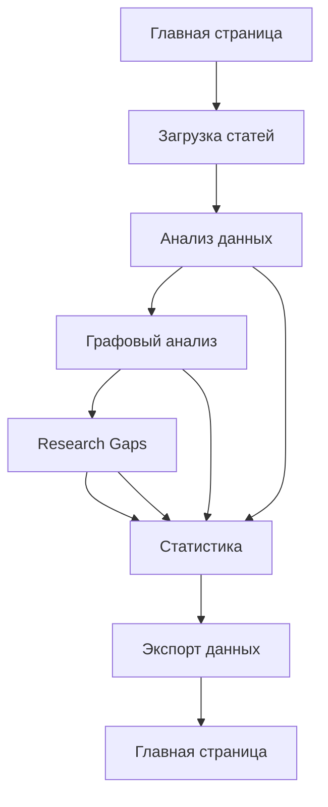

# Документация продукта: Анализатор научных статей для графового анализа

## 1. Обзор продукта

Приложение для автоматизированного анализа научных статей, которое извлекает и структурирует данные для графового анализа biochemical interactions и выявления research gaps. Помогает исследователям подготовить данные для публикации в Q1-журналах через автоматизированную обработку библиографических ссылок и веб-ресурсов.

## 2. Основные функции

### 2.1 Роли пользователей

| Роль          | Метод регистрации        | Основные права доступа                                             |
| ------------- | ------------------------ | ------------------------------------------------------------------ |
| Исследователь | Регистрация по email     | Может загружать статьи, запускать анализ, просматривать результаты |
| Администратор | Супер-админ по умолчанию | Полный доступ ко всем функциям и настройкам                        |

### 2.2 Функциональные модули

Приложение состоит из следующих основных страниц:

1. **Главная страница**: обзор проекта, навигация, статистика последних анализов
2. **Загрузка статей**: форма ввода ссылок, управление списком статей
3. **Анализ данных**: процесс извлечения информации, структурирование данных
4. **Графовый анализ**: визуализация biochemical interactions, поиск связей
5. **Research Gaps**: анализ пробелов в исследованиях, рекомендации
6. **Статистика**: сводная статистика по анализируемым данным, графики
7. **Экспорт данных**: подготовка данных для публикации, форматы вывода

### 2.3 Детализация страниц

| Название страницы | Название модуля           | Описание функции                                                                              |
| ----------------- | ------------------------- | --------------------------------------------------------------------------------------------- |
| Главная страница  | Обзор проекта             | Отображает статистику проекта, последние анализированные статьи, навигационное меню           |
| Загрузка статей   | Форма ввода ссылок        | Принимает веб-ссылки на научные статьи и библиографические данные (DOI, PMID, название)       |
| Загрузка статей   | Список статей             | Отображает загруженные статьи, позволяет удалять, переупорядочивать, отмечать для анализа     |
| Загрузка статей   | Проверка валидности       | Проверяет корректность ссылок, доступность источников                                         |
| Анализ данных     | Извлечение информации     | Парсинг статей, извлечение заголовков, авторов, аннотаций, ключевых слов                      |
| Анализ данных     | Структурирование данных   | Создание оптимизированной таблицы для графового анализа (entities, relationships, attributes) |
| Анализ данных     | Предварительная обработка | Нормализация данных, удаление дубликатов, стандартизация терминов                             |
| Графовый анализ   | Визуализация графа        | Интерактивная canvas-область для графа, панель управления масштабированием, легенда типов сущностей, фильтры по типам связей, tooltips при наведении                          |
| Графовый анализ   | Поиск связей              | Идентификация прямых и непрямых взаимодействий между биохимическими сущностями                |
| Графовый анализ   | Неочевидные связи         | Выявление скрытых паттернов и косвенных взаимодействий                                        |
| Графовый анализ   | Метрики центральности      | Расчет и визуализация показателей: центральность по посредничеству, близости, собственному вектору, степень центральности; сравнение распределения между подграфами |
| Графовый анализ   | Анализ сообществ           | Выявление сообществ с помощью алгоритмов Louvain, Girvan-Newman, Label Propagation; сравнительный анализ результатов; оценка устойчивости выявленных сообществ |
| Графовый анализ   | Динамический анализ        | Временные срезы для исследования эволюции графа; расчет показателей стабильности/изменчивости структуры; визуализация ключевых изменений |
| Графовый анализ   | Расширенная визуализация    | Интерактивные элементы управления отображением; фильтрация по весам ребер/значениям вершин; анимация динамических процессов |
| Графовый анализ   | Статистическая проверка    | Проверка значимости выявленных закономерностей; генерация случайных графов-контролей; сравнительный анализ с эргодическими моделями |
| Research Gaps     | Анализ пробелов           | Автоматическое выявление недостаточно изученных областей на основе графовой структуры         |
| Research Gaps     | Рекомендации              | Генерация предложений для будущих исследований                                                |
| Research Gaps     | Приоритизация             | Ранжирование research gaps по значимости и перспективности                                    |
| Статистика        | Общая статистика          | Количество проанализированных статей, сущностей, связей                                       |
| Статистика        | Детальная статистика      | Распределение по типам сущностей, кластерам, временным периодам                               |
| Статистика        | Графики и диаграммы       | Визуализация статистических данных в виде графиков                                            |
| Экспорт данных    | Подготовка к публикации   | Форматирование данных согласно требованиям Q1-журналов                                        |
| Экспорт данных    | Выбор форматов            | Экспорт в CSV, JSON, GML, GraphML и другие форматы                                            |
| Экспорт данных    | Метаданные                | Включение библиографических метаданных и информации об анализе                                |

## 3. Основные процессы

### 3.1 Основной рабочий процесс исследователя

1. Пользователь регистрируется в системе и переходит на страницу загрузки статей
2. Вводит веб-ссылки или библиографические данные научных статей
3. Система проверяет валидность ссылок и загружает контент статей
4. Пользователь запускает процесс анализа данных
5. Система извлекает и структурирует информацию из статей
6. Пользователь переходит к графовому анализу для визуализации biochemical interactions
7. Исследует связи, выявляет неочевидные паттерны взаимодействия
8. Переходит в раздел Research Gaps для анализа пробелов в исследованиях
9. Просматривает рекомендации и приоритизацию будущих исследований
10. Изучает статистику по анализируемым данным
11. Экспортирует подготовленные данные в нужном формате для публикации

### 3.2 Поток навигации

## 4. Дизайн пользовательского интерфейса

### 4.1 Стиль дизайна

* **Основной цвет**: #2563eb (синий) - для основных действий и акцентов

* **Вторичный цвет**: #10b981 (зеленый) - для успешных состояний и подтверждений

* **Дополнительный цвет**: #f59e0b (оранжевый) - для предупреждений

* **Цвет ошибок**: #ef4444 (красный) - для ошибок и удаления

* **Фон**: #f8fafc (светло-серый) - для основного фона

* **Карточки**: #ffffff (белый) - для карточек и контейнеров

* **Стиль кнопок**: Скругленные (border-radius: 8px), с легкой тенью

* **Шрифт**: Inter или Roboto, размер 14-16px для основного текста, 18-20px для заголовков

* **Макет**: Карточный дизайн, верхняя навигация, боковая панель для быстрого доступа

* **Иконки**: Feather Icons или Lucide Icons - минималистичный стиль

* **Анимации**: Плавные переходы (transition: 0.3s), fade-in эффекты для карточек

### 4.2 Обзор дизайна страниц

| Название страницы | Название модуля         | Элементы интерфейса                                                                                                                                                           |
| ----------------- | ----------------------- | ----------------------------------------------------------------------------------------------------------------------------------------------------------------------------- |
| Главная страница  | Обзор проекта           | Hero-секция с названием и описанием, карточки статистики с иконками, список последних анализов с датами, кнопка "Начать анализ", адаптивный сеточный макет                    |
| Загрузка статей   | Форма ввода ссылок      | Поле ввода для ссылок с placeholder, кнопка "Добавить статью", список загруженных статей с иконками состояния, кнопки удаления и редактирования, индикатор прогресса загрузки |
| Анализ данных     | Извлечение информации   | Карточка с прогресс-баром, список извлеченных данных в виде таблицы, кнопки управления процессом, цветовая индикация этапов анализа                                           |
| Графовый анализ   | Визуализация графа      | Интерактивная canvas-область для графа, панель управления масштабированием, легенда типов сущностей, фильтры по типам связей, tooltips при наведении                          |
| Research Gaps     | Анализ пробелов         | Карточки с research gaps, индикаторы приоритета, цветовая кодировка по значимости, кнопки "Подробнее" и "Экспорт", сортировка по различным критериям                          |
| Статистика        | Графики и диаграммы     | Графики в виде диаграмм (bar, line, pie), фильтры по периодам, таблицы с детальными данными, кнопка экспорта статистики                                                       |
| Экспорт данных    | Подготовка к публикации | Выбор формата экспорта (dropdown), превью данных, чекбоксы для включения метаданных, кнопка "Экспорт", прогресс экспорта                                                      |

### 4.3 Адаптивность

* **Подход**: Desktop-first с адаптацией для мобильных устройств

* **Точки адаптации**: Desktop (1024px+), Tablet (768px-1023px), Mobile (до 767px)

* **Touch-оптимизация**: Увеличенные области касания для мобильных устройств (минимум 44x44px), поддержка жестов для графового интерфейса

* **Ориентация**: Поддержка портретной и ландшафтной ориентации на мобильных устройствах

