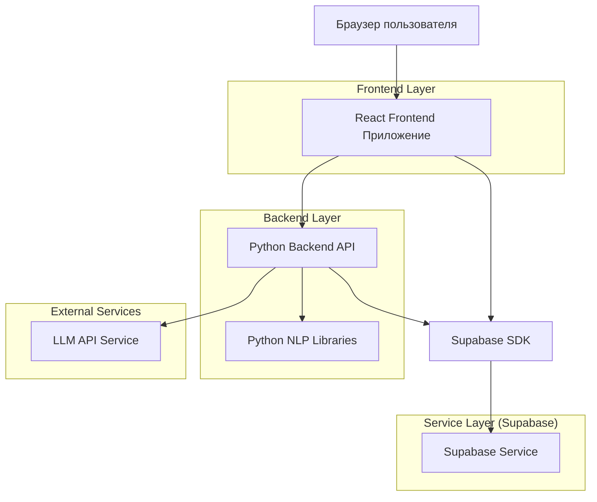
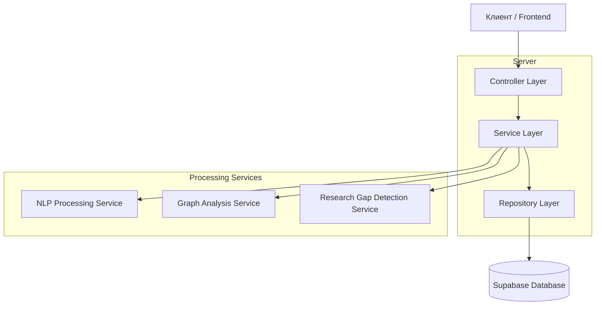
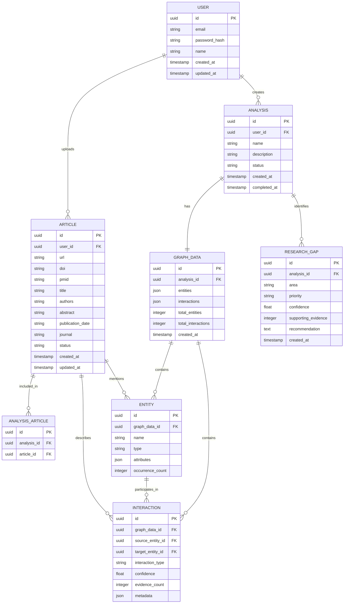

# Техническая архитектура: Анализатор научных статей для графового анализа

## 1. Архитектурный дизайн



## 2. Технологическое описание

- **Frontend**: React@18 + TypeScript + Vite + TailwindCSS@3
- **Backend**: Python@3.11+ + FastAPI
- **База данных**: Supabase (PostgreSQL)
- **NLP библиотеки**: spaCy, transformers, sentence-transformers
- **Графовая библиотека**: NetworkX, Pyvis
- **Визуализация**: React Flow, D3.js
- **LLM интеграция**: OpenAI API / Anthropic API

## 3. Определения маршрутов

| Маршрут | Назначение |
|---------|-----------|
| / | Главная страница с обзором и статистикой |
| /upload | Страница загрузки научных статей |
| /analysis | Страница анализа и извлечения данных |
| /graph-analysis | Страница графового анализа biochemical interactions |
| /research-gaps | Страница анализа research gaps |
| /statistics | Страница статистики и графиков |
| /export | Страница экспорта данных для публикации |
| /login | Страница входа в систему |
| /register | Страница регистрации |

## 4. Определения API

### 4.1 Основные API endpoints

#### Аутентификация пользователей
```
POST /api/auth/register
POST /api/auth/login
POST /api/auth/logout
GET /api/auth/me
```

#### Управление статьями
```
POST /api/articles/upload
GET /api/articles
GET /api/articles/:id
DELETE /api/articles/:id
```

Request (POST /api/articles/upload):
| Параметр | Тип | Обязательный | Описание |
|----------|-----|-------------|----------|
| url | string | true | Ссылка на научную статью |
| doi | string | false | DOI статьи |
| pmid | string | false | PMID статьи |
| title | string | false | Название статьи |

Response:
```json
{
  "id": "uuid",
  "url": "https://example.com/article",
  "doi": "10.1234/example",
  "pmid": "12345678",
  "title": "Example Article Title",
  "status": "uploaded",
  "created_at": "2026-01-06T10:00:00Z"
}
```

#### Анализ данных
```
POST /api/analysis/extract
POST /api/analysis/structure
GET /api/analysis/status/:id
```

Request (POST /api/analysis/extract):
| Параметр | Тип | Обязательный | Описание |
|----------|-----|-------------|----------|
| article_ids | string[] | true | Массив ID статей для анализа |

Response:
```json
{
  "analysis_id": "uuid",
  "status": "processing",
  "total_articles": 10,
  "processed": 3,
  "estimated_completion": "2026-01-06T10:15:00Z"
}
```

#### Графовый анализ
```
POST /api/graph/analyze
POST /api/graph/find-interactions
GET /api/graph/:id
```

Request (POST /api/graph/find-interactions):
| Параметр | Тип | Обязательный | Описание |
|----------|-----|-------------|----------|
| analysis_id | string | true | ID анализа |
| entity_types | string[] | false | Типы сущностей для поиска |
| depth | integer | false | Глубина поиска связей (default: 3) |

Response:
```json
{
  "interactions": [
    {
      "source_entity": "Protein A",
      "target_entity": "Protein B",
      "interaction_type": "binds",
      "confidence": 0.95,
      "evidence_count": 5,
      "articles": ["uuid1", "uuid2"]
    }
  ],
  "hidden_patterns": [
    {
      "pattern": "A -> B -> C",
      "description": "Indirect pathway",
      "significance": 0.78
    }
  ]
}
```

#### Research Gaps
```
POST /api/research-gaps/analyze
GET /api/research-gaps/:analysis_id
POST /api/research-gaps/prioritize
```

Request (POST /api/research-gaps/analyze):
| Параметр | Тип | Обязательный | Описание |
|----------|-----|-------------|----------|
| graph_id | string | true | ID графа для анализа |
| focus_areas | string[] | false | Фокусные области анализа |

Response:
```json
{
  "gaps": [
    {
      "id": "uuid",
      "area": "Interaction between Protein X and Protein Y",
      "priority": "high",
      "confidence": 0.85,
      "supporting_evidence": 3,
      "recommendation": "Investigate direct binding mechanism"
    }
  ]
}
```

#### Статистика
```
GET /api/statistics/overview
GET /api/statistics/detailed
GET /api/statistics/trends
```

Response (GET /api/statistics/overview):
```json
{
  "total_articles": 150,
  "total_entities": 2450,
  "total_interactions": 8900,
  "unique_proteins": 1200,
  "unique_pathways": 85,
  "analysis_date_range": {
    "start": "2025-01-01",
    "end": "2026-01-06"
  }
}
```

#### Экспорт данных
```
POST /api/export/generate
GET /api/export/:id
GET /api/export/download/:id
```

Request (POST /api/export/generate):
| Параметр | Тип | Обязательный | Описание |
|----------|-----|-------------|----------|
| analysis_id | string | true | ID анализа |
| format | string | true | Формат экспорта (csv, json, gml, graphml) |
| include_metadata | boolean | false | Включить метаданные (default: true) |
| journal_format | string | false | Формат для Q1-журнала |

## 5. Архитектура сервера



## 6. Воспроизводимость и методология исследования

### 6.1 Документирование алгоритмов

Все алгоритмы графового анализа должны быть документированы с указанием:

- **Название алгоритма** (например, Louvain community detection)
- **Реализуемая ссылка** на оригинальную публикацию
- **Параметры настройки** с описанием диапазонов значений
- **Версия библиотеки** и её SHA-хэш
- **Сложность по времени и памяти**

### 6.2 Хранение метаданных анализа

Для каждого анализа сохраняется:

```sql
-- create table
CREATE TABLE analysis_metadata (
    id UUID PRIMARY KEY DEFAULT gen_random_uuid(),
    graph_data_id UUID REFERENCES graph_data(id) ON DELETE CASCADE,
    analysis_type VARCHAR(100) NOT NULL,
    algorithm_name VARCHAR(100) NOT NULL,
    algorithm_version VARCHAR(50) NOT NULL,
    parameters JSONB NOT NULL,
    library_versions JSONB NOT NULL,
    execution_time_ms INTEGER,
    timestamp TIMESTAMP WITH TIME ZONE DEFAULT NOW()
);

-- create index
CREATE INDEX idx_analysis_metadata_graph_data_id ON analysis_metadata(graph_data_id);
CREATE INDEX idx_analysis_metadata_analysis_type ON analysis_metadata(analysis_type);

-- grant permissions
GRANT SELECT ON analysis_metadata TO anon;
GRANT ALL PRIVILEGES ON analysis_metadata TO authenticated;
```

### 6.3 Тестовые случаи и валидация

Для каждого алгоритма предусмотрены стандартные тестовые случаи:

1. **Synthetic graphs** - с известными свойствами
2. **Benchmark datasets** - из общедоступных источников
3. **Reproducibility checks** - повторяемость результатов при фиксированном seed

### 6.4 Совместимость с конвейером обработки данных

Все компоненты графового анализа интегрируются через стандартизированный интерфейс:

- **Input**: Graph в формате NetworkX или GEXF
- **Output**: JSON с результатами + метаданными
- **Logging**: Детальные логи всех этапов обработки
- **Error handling**: Стандартизированные коды ошибок и сообщения

## 7. Модель данных

### 6.1 Определение модели данных



### 6.2 Определение языка данных (DDL)

**Таблица пользователей (users)**
```sql
-- create table
CREATE TABLE users (
    id UUID PRIMARY KEY DEFAULT gen_random_uuid(),
    email VARCHAR(255) UNIQUE NOT NULL,
    password_hash VARCHAR(255) NOT NULL,
    name VARCHAR(100) NOT NULL,
    created_at TIMESTAMP WITH TIME ZONE DEFAULT NOW(),
    updated_at TIMESTAMP WITH TIME ZONE DEFAULT NOW()
);

-- create index
CREATE INDEX idx_users_email ON users(email);

-- grant permissions
GRANT SELECT ON users TO anon;
GRANT ALL PRIVILEGES ON users TO authenticated;
```

**Таблица статей (articles)**
```sql
-- create table
CREATE TABLE articles (
    id UUID PRIMARY KEY DEFAULT gen_random_uuid(),
    user_id UUID REFERENCES users(id) ON DELETE CASCADE,
    url TEXT,
    doi VARCHAR(100),
    pmid VARCHAR(20),
    title TEXT,
    authors TEXT,
    abstract TEXT,
    publication_date DATE,
    journal VARCHAR(255),
    status VARCHAR(20) DEFAULT 'uploaded' CHECK (status IN ('uploaded', 'processing', 'completed', 'error')),
    content JSONB,
    created_at TIMESTAMP WITH TIME ZONE DEFAULT NOW(),
    updated_at TIMESTAMP WITH TIME ZONE DEFAULT NOW()
);

-- create index
CREATE INDEX idx_articles_user_id ON articles(user_id);
CREATE INDEX idx_articles_status ON articles(status);
CREATE INDEX idx_articles_doi ON articles(doi);
CREATE INDEX idx_articles_pmid ON articles(pmid);
CREATE INDEX idx_articles_created_at ON articles(created_at DESC);

-- grant permissions
GRANT SELECT ON articles TO anon;
GRANT ALL PRIVILEGES ON articles TO authenticated;
```

**Таблица анализов (analyses)**
```sql
-- create table
CREATE TABLE analyses (
    id UUID PRIMARY KEY DEFAULT gen_random_uuid(),
    user_id UUID REFERENCES users(id) ON DELETE CASCADE,
    name VARCHAR(255) NOT NULL,
    description TEXT,
    status VARCHAR(20) DEFAULT 'pending' CHECK (status IN ('pending', 'processing', 'completed', 'error')),
    created_at TIMESTAMP WITH TIME ZONE DEFAULT NOW(),
    completed_at TIMESTAMP WITH TIME ZONE
);

-- create index
CREATE INDEX idx_analyses_user_id ON analyses(user_id);
CREATE INDEX idx_analyses_status ON analyses(status);
CREATE INDEX idx_analyses_created_at ON analyses(created_at DESC);

-- grant permissions
GRANT SELECT ON analyses TO anon;
GRANT ALL PRIVILEGES ON analyses TO authenticated;
```

**Таблица связи анализ-статья (analysis_articles)**
```sql
-- create table
CREATE TABLE analysis_articles (
    id UUID PRIMARY KEY DEFAULT gen_random_uuid(),
    analysis_id UUID REFERENCES analyses(id) ON DELETE CASCADE,
    article_id UUID REFERENCES articles(id) ON DELETE CASCADE,
    UNIQUE(analysis_id, article_id)
);

-- create index
CREATE INDEX idx_analysis_articles_analysis_id ON analysis_articles(analysis_id);
CREATE INDEX idx_analysis_articles_article_id ON analysis_articles(article_id);

-- grant permissions
GRANT SELECT ON analysis_articles TO anon;
GRANT ALL PRIVILEGES ON analysis_articles TO authenticated;
```

**Таблица графовых данных (graph_data)**
```sql
-- create table
CREATE TABLE graph_data (
    id UUID PRIMARY KEY DEFAULT gen_random_uuid(),
    analysis_id UUID REFERENCES analyses(id) ON DELETE CASCADE,
    entities JSONB NOT NULL,
    interactions JSONB NOT NULL,
    total_entities INTEGER DEFAULT 0,
    total_interactions INTEGER DEFAULT 0,
    time_slices JSONB,
    created_at TIMESTAMP WITH TIME ZONE DEFAULT NOW()
);

-- create index
CREATE INDEX idx_graph_data_analysis_id ON graph_data(analysis_id);

-- grant permissions
GRANT SELECT ON graph_data TO anon;
GRANT ALL PRIVILEGES ON graph_data TO authenticated;
```

**Таблица метрик центральности (centrality_metrics)**
```sql
-- create table
CREATE TABLE centrality_metrics (
    id UUID PRIMARY KEY DEFAULT gen_random_uuid(),
    graph_data_id UUID REFERENCES graph_data(id) ON DELETE CASCADE,
    entity_id UUID REFERENCES entities(id),
    degree_centrality FLOAT,
    betweenness_centrality FLOAT,
    closeness_centrality FLOAT,
    eigenvector_centrality FLOAT,
    calculated_at TIMESTAMP WITH TIME ZONE DEFAULT NOW()
);

-- create index
CREATE INDEX idx_centrality_metrics_graph_data_id ON centrality_metrics(graph_data_id);
CREATE INDEX idx_centrality_metrics_entity_id ON centrality_metrics(entity_id);

-- grant permissions
GRANT SELECT ON centrality_metrics TO anon;
GRANT ALL PRIVILEGES ON centrality_metrics TO authenticated;
```

**Таблица сообществ (communities)**
```sql
-- create table
CREATE TABLE communities (
    id UUID PRIMARY KEY DEFAULT gen_random_uuid(),
    graph_data_id UUID REFERENCES graph_data(id) ON DELETE CASCADE,
    algorithm VARCHAR(50) NOT NULL,
    community_id VARCHAR(100) NOT NULL,
    size INTEGER NOT NULL,
    modularity FLOAT,
    entities JSONB NOT NULL,
    calculated_at TIMESTAMP WITH TIME ZONE DEFAULT NOW()
);

-- create index
CREATE INDEX idx_communities_graph_data_id ON communities(graph_data_id);
CREATE INDEX idx_communities_algorithm ON communities(algorithm);
CREATE INDEX idx_communities_community_id ON communities(community_id);

-- grant permissions
GRANT SELECT ON communities TO anon;
GRANT ALL PRIVILEGES ON communities TO authenticated;
```

**Таблица статистической валидации (statistical_validation)**
```sql
-- create table
CREATE TABLE statistical_validation (
    id UUID PRIMARY KEY DEFAULT gen_random_uuid(),
    graph_data_id UUID REFERENCES graph_data(id) ON DELETE CASCADE,
    metric_name VARCHAR(100) NOT NULL,
    observed_value FLOAT,
    expected_value FLOAT,
    p_value FLOAT,
    is_significant BOOLEAN,
    null_model VARCHAR(50),
    confidence_level FLOAT,
    confidence_interval JSONB,
    calculated_at TIMESTAMP WITH TIME ZONE DEFAULT NOW()
);

-- create index
CREATE INDEX idx_statistical_validation_graph_data_id ON statistical_validation(graph_data_id);
CREATE INDEX idx_statistical_validation_metric_name ON statistical_validation(metric_name);

-- grant permissions
GRANT SELECT ON statistical_validation TO anon;
GRANT ALL PRIVILEGES ON statistical_validation TO authenticated;
```

**Таблица сущностей (entities)**
```sql
-- create table
CREATE TABLE entities (
    id UUID PRIMARY KEY DEFAULT gen_random_uuid(),
    graph_data_id UUID REFERENCES graph_data(id) ON DELETE CASCADE,
    name VARCHAR(255) NOT NULL,
    type VARCHAR(50) NOT NULL,
    attributes JSONB,
    occurrence_count INTEGER DEFAULT 0,
    created_at TIMESTAMP WITH TIME ZONE DEFAULT NOW()
);

-- create index
CREATE INDEX idx_entities_graph_data_id ON entities(graph_data_id);
CREATE INDEX idx_entities_type ON entities(type);
CREATE INDEX idx_entities_name ON entities(name);

-- grant permissions
GRANT SELECT ON entities TO anon;
GRANT ALL PRIVILEGES ON entities TO authenticated;
```

**Таблица взаимодействий (interactions)**
```sql
-- create table
CREATE TABLE interactions (
    id UUID PRIMARY KEY DEFAULT gen_random_uuid(),
    graph_data_id UUID REFERENCES graph_data(id) ON DELETE CASCADE,
    source_entity_id UUID REFERENCES entities(id),
    target_entity_id UUID REFERENCES entities(id),
    interaction_type VARCHAR(50) NOT NULL,
    confidence FLOAT CHECK (confidence >= 0 AND confidence <= 1),
    evidence_count INTEGER DEFAULT 0,
    metadata JSONB,
    created_at TIMESTAMP WITH TIME ZONE DEFAULT NOW()
);

-- create index
CREATE INDEX idx_interactions_graph_data_id ON interactions(graph_data_id);
CREATE INDEX idx_interactions_source ON interactions(source_entity_id);
CREATE INDEX idx_interactions_target ON interactions(target_entity_id);
CREATE INDEX idx_interactions_type ON interactions(interaction_type);

-- grant permissions
GRANT SELECT ON interactions TO anon;
GRANT ALL PRIVILEGES ON interactions TO authenticated;
```

**Таблица research gaps (research_gaps)**
```sql
-- create table
CREATE TABLE research_gaps (
    id UUID PRIMARY KEY DEFAULT gen_random_uuid(),
    analysis_id UUID REFERENCES analyses(id) ON DELETE CASCADE,
    area TEXT NOT NULL,
    priority VARCHAR(20) CHECK (priority IN ('low', 'medium', 'high', 'critical')),
    confidence FLOAT CHECK (confidence >= 0 AND confidence <= 1),
    supporting_evidence INTEGER DEFAULT 0,
    recommendation TEXT,
    created_at TIMESTAMP WITH TIME ZONE DEFAULT NOW()
);

-- create index
CREATE INDEX idx_research_gaps_analysis_id ON research_gaps(analysis_id);
CREATE INDEX idx_research_gaps_priority ON research_gaps(priority);
CREATE INDEX idx_research_gaps_confidence ON research_gaps(confidence DESC);

-- grant permissions
GRANT SELECT ON research_gaps TO anon;
GRANT ALL PRIVILEGES ON research_gaps TO authenticated;
```

**Таблица генов (genes)**
```sql
-- create table
CREATE TABLE genes (
    id UUID PRIMARY KEY DEFAULT gen_random_uuid(),
    gene_symbol VARCHAR(20) UNIQUE NOT NULL,
    gene_name VARCHAR(255),
    ensembl_id VARCHAR(30),
    ncbi_id VARCHAR(20),
    organism VARCHAR(100),
    chromosome VARCHAR(10),
    start_position INTEGER,
    end_position INTEGER,
    strand VARCHAR(1),
    gene_type VARCHAR(50),
    description TEXT,
    aliases JSONB,
    annotations JSONB,
    created_at TIMESTAMP WITH TIME ZONE DEFAULT NOW()
);

-- create index
CREATE INDEX idx_genes_symbol ON genes(gene_symbol);
CREATE INDEX idx_genes_ensembl_id ON genes(ensembl_id);
CREATE INDEX idx_genes_ncbi_id ON genes(ncbi_id);
CREATE INDEX idx_genes_organism ON genes(organism);
CREATE INDEX idx_genes_type ON genes(gene_type);

-- grant permissions
GRANT SELECT ON genes TO anon;
GRANT ALL PRIVILEGES ON genes TO authenticated;
```

**Таблица белков (proteins)**
```sql
-- create table
CREATE TABLE proteins (
    id UUID PRIMARY KEY DEFAULT gen_random_uuid(),
    protein_name VARCHAR(255) NOT NULL,
    uniprot_id VARCHAR(20) UNIQUE,
    gene_id UUID REFERENCES genes(id) ON DELETE SET NULL,
    protein_type VARCHAR(50),
    molecular_weight FLOAT,
    length INTEGER,
    sequence TEXT,
    domains JSONB,
    go_terms JSONB,
    pathways JSONB,
    diseases JSONB,
    structures JSONB,
    description TEXT,
    created_at TIMESTAMP WITH TIME ZONE DEFAULT NOW()
);

-- create index
CREATE INDEX idx_proteins_uniprot_id ON proteins(uniprot_id);
CREATE INDEX idx_proteins_gene_id ON proteins(gene_id);
CREATE INDEX idx_proteins_type ON proteins(protein_type);

-- grant permissions
GRANT SELECT ON proteins TO anon;
GRANT ALL PRIVILEGES ON proteins TO authenticated;
```

**Таблица биохимических процессов (biochemical_processes)**
```sql
-- create table
CREATE TABLE biochemical_processes (
    id UUID PRIMARY KEY DEFAULT gen_random_uuid(),
    process_name VARCHAR(255) NOT NULL,
    process_type VARCHAR(50) NOT NULL,
    kegg_id VARCHAR(20),
    reactome_id VARCHAR(30),
    pathway_classification VARCHAR(100),
    description TEXT,
    process_category VARCHAR(50),
    subcategory VARCHAR(100),
    organisms JSONB,
    tissues JSONB,
    cellular_location JSONB,
    key_enzymes JSONB,
    regulation JSONB,
    diseases JSONB,
    references JSONB,
    created_at TIMESTAMP WITH TIME ZONE DEFAULT NOW()
);

-- create index
CREATE INDEX idx_biochemical_processes_name ON biochemical_processes(process_name);
CREATE INDEX idx_biochemical_processes_type ON biochemical_processes(process_type);
CREATE INDEX idx_biochemical_processes_kegg_id ON biochemical_processes(kegg_id);
CREATE INDEX idx_biochemical_processes_reactome_id ON biochemical_processes(reactome_id);
CREATE INDEX idx_biochemical_processes_category ON biochemical_processes(process_category);

-- grant permissions
GRANT SELECT ON biochemical_processes TO anon;
GRANT ALL PRIVILEGES ON biochemical_processes TO authenticated;
```

**Таблица метаболитов (metabolites)**
```sql
-- create table
CREATE TABLE metabolites (
    id UUID PRIMARY KEY DEFAULT gen_random_uuid(),
    metabolite_name VARCHAR(255) NOT NULL,
    pubchem_id VARCHAR(20),
    hmdb_id VARCHAR(20),
    chebi_id VARCHAR(20),
    kegg_id VARCHAR(20),
    metabolite_type VARCHAR(50),
    chemical_formula VARCHAR(100),
    molecular_weight FLOAT,
    pathways JSONB,
    enzymes JSONB,
    diseases JSONB,
    cellular_location JSONB,
    properties JSONB,
    description TEXT,
    created_at TIMESTAMP WITH TIME ZONE DEFAULT NOW()
);

-- create index
CREATE INDEX idx_metabolites_name ON metabolites(metabolite_name);
CREATE INDEX idx_metabolites_pubchem_id ON metabolites(pubchem_id);
CREATE INDEX idx_metabolites_hmdb_id ON metabolites(hmdb_id);
CREATE INDEX idx_metabolites_type ON metabolites(metabolite_type);

-- grant permissions
GRANT SELECT ON metabolites TO anon;
GRANT ALL PRIVILEGES ON metabolites TO authenticated;
```

**Таблица механизмов взаимодействия (interaction_mechanisms)**
```sql
-- create table
CREATE TABLE interaction_mechanisms (
    id UUID PRIMARY KEY DEFAULT gen_random_uuid(),
    mechanism_type VARCHAR(100) NOT NULL,
    mechanism_category VARCHAR(50),
    description TEXT,
    binding_site JSONB,
    kinetics JSONB,
    thermodynamics JSONB,
    structural_basis TEXT,
    regulatory_effects JSONB,
    experimental_evidence JSONB,
    inhibitors JSONB,
    activators JSONB,
    conditions JSONB,
    references JSONB,
    created_at TIMESTAMP WITH TIME ZONE DEFAULT NOW()
);

-- create index
CREATE INDEX idx_interaction_mechanisms_type ON interaction_mechanisms(mechanism_type);
CREATE INDEX idx_interaction_mechanisms_category ON interaction_mechanisms(mechanism_category);

-- grant permissions
GRANT SELECT ON interaction_mechanisms TO anon;
GRANT ALL PRIVILEGES ON interaction_mechanisms TO authenticated;
```

**Таблица связей процесс-сущность (process_entities)**
```sql
-- create table
CREATE TABLE process_entities (
    id UUID PRIMARY KEY DEFAULT gen_random_uuid(),
    process_id UUID REFERENCES biochemical_processes(id) ON DELETE CASCADE,
    entity_type VARCHAR(50) NOT NULL,
    entity_id UUID NOT NULL,
    role VARCHAR(100),
    participation_type VARCHAR(50),
    evidence_level VARCHAR(20),
    conditions JSONB,
    annotations JSONB,
    created_at TIMESTAMP WITH TIME ZONE DEFAULT NOW()
);

-- create index
CREATE INDEX idx_process_entities_process_id ON process_entities(process_id);
CREATE INDEX idx_process_entities_entity_type ON process_entities(entity_type);
CREATE INDEX idx_process_entities_entity_id ON process_entities(entity_id);

-- grant permissions
GRANT SELECT ON process_entities TO anon;
GRANT ALL PRIVILEGES ON process_entities TO authenticated;
```

**Таблица гипотез (hypotheses)**
```sql
-- create table
CREATE TABLE hypotheses (
    id UUID PRIMARY KEY DEFAULT gen_random_uuid(),
    analysis_id UUID REFERENCES analyses(id) ON DELETE CASCADE,
    hypothesis_text TEXT NOT NULL,
    hypothesis_type VARCHAR(50),
    confidence FLOAT CHECK (confidence >= 0 AND confidence <= 1),
    supporting_evidence JSONB,
    contradictory_evidence JSONB,
    test_method TEXT,
    feasibility VARCHAR(20),
    impact_score FLOAT,
    novelty_score FLOAT,
    research_priority VARCHAR(20),
    status VARCHAR(20) DEFAULT 'proposed' CHECK (status IN ('proposed', 'testing', 'validated', 'rejected')),
    generated_by VARCHAR(50),
    generated_at TIMESTAMP WITH TIME ZONE DEFAULT NOW()
);

-- create index
CREATE INDEX idx_hypotheses_analysis_id ON hypotheses(analysis_id);
CREATE INDEX idx_hypotheses_type ON hypotheses(hypothesis_type);
CREATE INDEX idx_hypotheses_confidence ON hypotheses(confidence DESC);
CREATE INDEX idx_hypotheses_status ON hypotheses(status);
CREATE INDEX idx_hypotheses_priority ON hypotheses(research_priority);

-- grant permissions
GRANT SELECT ON hypotheses TO anon;
GRANT ALL PRIVILEGES ON hypotheses TO authenticated;
```

**Таблица выявленных закономерностей (discovered_patterns)**
```sql
-- create table
CREATE TABLE discovered_patterns (
    id UUID PRIMARY KEY DEFAULT gen_random_uuid(),
    analysis_id UUID REFERENCES analyses(id) ON DELETE CASCADE,
    pattern_type VARCHAR(50) NOT NULL,
    pattern_description TEXT NOT NULL,
    pattern_data JSONB NOT NULL,
    significance_score FLOAT,
    confidence FLOAT CHECK (confidence >= 0 AND confidence <= 1),
    frequency INTEGER DEFAULT 1,
    context JSONB,
    examples JSONB,
    implications TEXT,
    validation_status VARCHAR(20) DEFAULT 'pending' CHECK (validation_status IN ('pending', 'validated', 'rejected')),
    discovery_method VARCHAR(100),
    created_at TIMESTAMP WITH TIME ZONE DEFAULT NOW()
);

-- create index
CREATE INDEX idx_discovered_patterns_analysis_id ON discovered_patterns(analysis_id);
CREATE INDEX idx_discovered_patterns_type ON discovered_patterns(pattern_type);
CREATE INDEX idx_discovered_patterns_significance ON discovered_patterns(significance_score DESC);
CREATE INDEX idx_discovered_patterns_validation_status ON discovered_patterns(validation_status);

-- grant permissions
GRANT SELECT ON discovered_patterns TO anon;
GRANT ALL PRIVILEGES ON discovered_patterns TO authenticated;
```

**Таблица обобщений (summaries)**
```sql
-- create table
CREATE TABLE summaries (
    id UUID PRIMARY KEY DEFAULT gen_random_uuid(),
    analysis_id UUID REFERENCES analyses(id) ON DELETE CASCADE,
    summary_type VARCHAR(50) NOT NULL,
    summary_text TEXT NOT NULL,
    scope VARCHAR(50),
    key_findings JSONB,
    confidence_score FLOAT CHECK (confidence_score >= 0 AND confidence_score <= 1),
    coverage_score FLOAT,
    source_articles JSONB,
    methods_used JSONB,
    generated_at TIMESTAMP WITH TIME ZONE DEFAULT NOW()
);

-- create index
CREATE INDEX idx_summaries_analysis_id ON summaries(analysis_id);
CREATE INDEX idx_summaries_type ON summaries(summary_type);

-- grant permissions
GRANT SELECT ON summaries TO anon;
GRANT ALL PRIVILEGES ON summaries TO authenticated;
```
