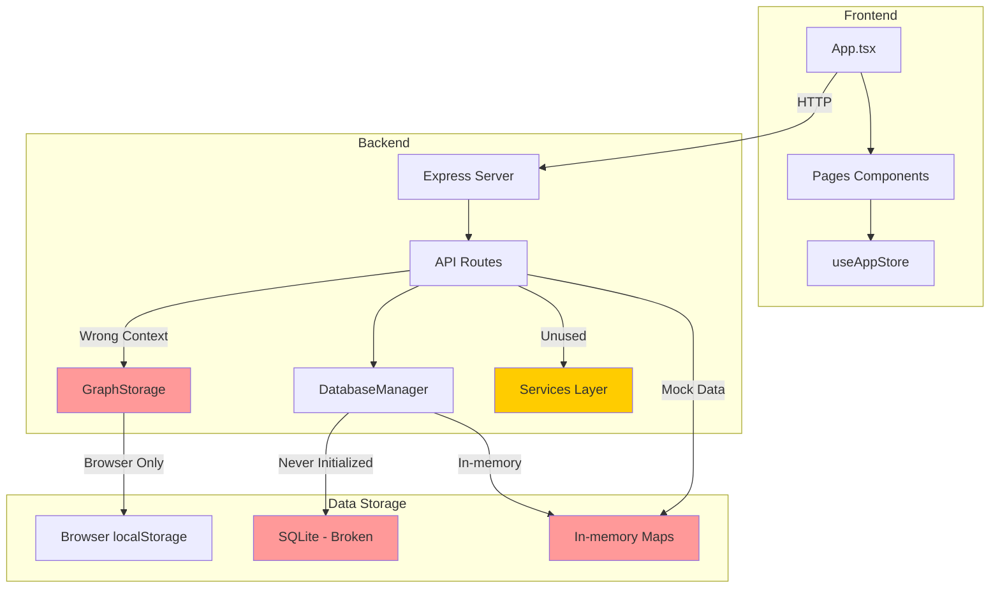

# Архитектурный анализ проекта Graph Analyser

**Дата анализа:** 2026-01-07
**Статус:** Критические архитектурные проблемы обнаружены

---

## 🚨 КРИТИЧЕСКАЯ ПРОБЛЕМА: npm install не работает

### Описание
`npm install` постоянно завершается неудачно, даже после нескольких попыток.

### Причина
Проблема в архитектуре зависимостей в [`package.json`](../package.json):

1. **sqlite3** (строка 31) - native модуль, требует C++ компиляцию
   - Требует Visual Studio Build Tools на Windows
   - Компиляция часто падает с ошибками

2. **@types/better-sqlite3** (строка 41) - типы для better-sqlite3
   - Но **better-sqlite3** НЕ указан в dependencies!
   - Это вызывает конфликты при установке

3. **multer** используется в коде, но НЕ в dependencies
   - [`api/routes/documents.ts`](../api/routes/documents.ts:2) импортирует multer
   - [`api/server-simple.ts`](../api/server-simple.ts:3) импортирует multer
   - Но multer отсутствует в package.json

4. **@types/multer** (строка 42) - типы для multer
   - Но сам multer НЕ в dependencies!

### Влияние на архитектуру
Это **фундаментальная архитектурная проблема**:

- Проект пытается использовать native модули (sqlite3) для кроссплатформенного приложения
- Отсутствуют зависимости, которые используются в коде
- Несогласованность между devDependencies и dependencies
- Невозможно установить проект без Visual Studio Build Tools

### Решения

**Вариант A: Удалить native модули (Рекомендуется)**
```json
// Удалить из dependencies:
- "sqlite3": "^5.1.7"
```

И заменить на:
- In-memory хранилище (уже используется в Database.ts)
- Или PostgreSQL через Supabase (уже есть @supabase/supabase-js)

**Вариант B: Исправить package.json**
```json
{
  "dependencies": {
    // Добавить отсутствующие:
    "multer": "^1.4.5-lts.1",
    
    // Удалить проблемные:
    // "sqlite3": "^5.1.7",  // Удалить native модуль
    
    // Или добавить если нужен:
    // "better-sqlite3": "^11.8.1"  // Вместо sqlite3
  },
  "devDependencies": {
    // Удалить типы для несуществующих пакетов:
    // "@types/better-sqlite3": "^7.6.9",  // Удалить если better-sqlite3 не используется
    // "@types/multer": "^1.4.12"  // Удалить если multer не в dependencies
  }
}
```

**Вариант C: Использовать веб-версию**
- Перенести фронтенд на Vercel/Netlify (уже есть vercel.json)
- Использовать Supabase как backend (BaaS)
- Полностью убрать native зависимости

---

## 🚨 КРИТИЧЕСКАЯ ПРОБЛЕМА: Белый экран при открытии приложения

### Описание
При открытии `dist/index.html` напрямую из файловой системы отображается белый экран с текстом "HTML is loading..." и навигационная панель не работает.

### Причина
Проблема в конфигурации [`vite.config.ts`](../vite.config.ts):

1. Vite по умолчанию использует абсолютные пути (`/assets/...`) для сгенерированных файлов
2. При открытии HTML файла напрямую (протокол `file://`), браузер пытается загрузить:
   - `file:///assets/index-DPeHtR0I.js` вместо `file:///d:/.../dist/assets/index-DPeHtR0I.js`
3. JavaScript файл не загружается, React приложение не рендерится
4. Остается только fallback сообщение "HTML is loading..." из [`index.html`](../index.html:38)

### Решение
Добавить `base: './'` в [`vite.config.ts`](../vite.config.ts):

```typescript
export default defineConfig({
  base: './', // Добавить эту строку
  plugins: [ ... ],
  // ...
})
```

После изменения нужно пересобрать проект:
```bash
npm run build
```

Это заставит Vite генерировать относительные пути вместо абсолютных, что позволит открывать `dist/index.html` напрямую.

---

## 📋 Резюме

**Вердикт:** Проект НЕ требует полного переписывания с нуля, но требует существенного рефакторинга для работоспособности.

**Основная проблема:** Несогласованная архитектура с множественными конфликтующими механизмами хранения данных, которые не работают вместе.

**Текущая готовность:** ~80% (фронтенд работает, бэкенд частично функционален)

---

## 🏗️ Архитектурные проблемы

### 1. КРИТИЧЕСКАЯ: Сломанный DatabaseManager

**Файл:** [`src/core/Database.ts`](../src/core/Database.ts)

**Проблема:**
- Класс `DatabaseManager` содержит код для создания SQL таблиц (строки 76-181)
- Однако `this.db` свойство никогда не инициализируется
- Все методы используют `this.db!` (non-null assertion), что приведет к runtime ошибкам
- Вместо этого используются in-memory Maps (строки 55-59)

```typescript
// Линии 55-60: In-memory хранилище
private articles: Map<string, Article> = new Map();
private edges: Map<string, ArticleEdge> = new Map();
private patterns: Map<string, Pattern> = new Map();
private users: Map<string, User> = new Map();
private graphs: Map<string, Graph> = new Map();

// Линии 76-78: SQL код, который никогда не выполнится
private createTables(): void {
  if (!this.db) throw new Error('Database not initialized');  // Всегда выбросит ошибку
```

**Влияние:**
- Данные теряются при каждом перезапуске сервера
- Нет персистентности
- SQL индексы и оптимизации не работают

---

### 2. КРИТИЧЕСКАЯ: Несогласованное хранение данных

**Проблема:** Проект использует 4 разных механизма хранения данных, которые конфликтуют друг с другом:

| Механизм | Файл | Тип | Проблема |
|----------|------|-----|----------|
| In-memory Maps | `Database.ts` | Runtime | Данные теряются при перезапуске |
| LocalStorage | `GraphStorage.ts` | Browser-only | Используется в бэкенде (ошибка!) |
| Static arrays | `api/routes/articles.ts` | Runtime | Mock данные |
| SQL (сломанный) | `Database.ts` | Database | Не работает |

**Пример конфликта в [`api/routes/graphs.ts`](../api/routes/graphs.ts):**

```typescript
// Линия 13: In-memory Map
const graphsStore = new Map<string, Graph>()

// Линия 14: Separate Map for analyzers
const analyzers = new Map<string, GraphAnalyzer>()

// Линия 15: DatabaseManager (использует in-memory Maps)
const db = new DatabaseManager()

// Линия 88: GraphStorage (localStorage - браузер!)
GraphStorage.save(graph)
```

**Влияние:**
- Нет единого источника правды (Single Source of Truth)
- Данные могут дублироваться или теряться
- Непредсказуемое поведение приложения

---

### 3. КРИТИЧЕСКАЯ: Несогласованные типы данных

**Проблема:** Один и тот же интерфейс `Article` определен в 4 разных местах с разными полями:

| Файл | Поля | Конфликт |
|------|-------|----------|
| [`shared/types.ts`](../shared/types.ts) | `id, title, authors[], year, abstract?, keywords?, citations?[], doi?, url?, published?` | Базовый тип |
| [`src/core/Database.ts`](../src/core/Database.ts) | `id, title, content, url?, status, uploadedAt, updatedAt?, userId?, metadata?` | Разные поля! |
| [`api/routes/articles.ts`](../api/routes/articles.ts) | `id, title, year, citations, category, author, abstract, keywords[]` | Разные поля! |
| [`src/store/useAppStore.ts`](../src/store/useAppStore.ts) | `id, title, authors[], year, journal?, doi?, pmid?, abstract?, keywords?[], url?` | Разные поля! |

**Влияние:**
- TypeScript не может гарантировать типобезопасность
- Потенциальные ошибки при передаче данных между модулями
- Путаница при разработке

---

### 4. ВЫСОКАЯ: Mock данные вместо реальной логики

**Проблема:** Все API маршруты используют статические mock данные вместо реальной бизнес-логики.

**Пример в [`api/routes/articles.ts`](../api/routes/articles.ts):**

```typescript
// Линии 17-26: Хардкодированные данные
const articles: ArticleNode[] = [
  { id: 'a1', title: 'P53 signaling pathway in cancer', year: 2023, citations: 145, ... },
  { id: 'a2', title: 'MDM2 regulation mechanisms', year: 2022, citations: 98, ... },
  // ...
]
```

**Проблема в [`src/pages/AnalysisPage.tsx`](../src/pages/AnalysisPage.tsx):**

```typescript
// Линии 17-24: Хардкодированные шаги анализа
const steps: AnalysisStep[] = [
  { description: 'Извлечение сущностей', status: 'completed', progress: 100 },
  { description: 'Выявление взаимодействий', status: 'completed', progress: 100 },
  // ...
]
```

**Влияние:**
- Приложение не выполняет реальный анализ
- Результаты не соответствуют загруженным данным
- Невозможно использовать в production

---

### 5. СРЕДНЯЯ: Сервисный слой не интегрирован

**Проблема:** Сервисы существуют, но не используются в API маршрутах.

**Существующие сервисы:**
- [`api/services/entityExtractor.ts`](../api/services/entityExtractor.ts) - Извлечение сущностей из текста
- [`api/services/relationExtractor.ts`](../api/services/relationExtractor.ts) - Извлечение связей
- [`api/services/knowledgeGraphBuilder.ts`](../api/services/knowledgeGraphBuilder.ts) - Построение графов
- [`api/services/graphCentrality.ts`](../api/services/graphCentrality.ts) - Расчет центральности
- [`api/services/pathAnalysis.ts`](../api/services/pathAnalysis.ts) - Анализ путей
- [`api/services/researchGapDetection.ts`](../api/services/researchGapDetection.ts) - Поиск пробелов

**Проблема:** Эти сервисы не импортируются и не используются в [`api/routes/`](../api/routes/).

**Влияние:**
- Написанный код бесполезен
- Дублирование функциональности
- Потеря времени на разработку

---

### 6. СРЕДНЯЯ: Проблемы с зависимостями

**Проблема:**
- `better-sqlite3` указан в `package.json` но не установлен
- Требует Visual Studio Build Tools для компиляции на Windows
- Это блокирует запуск бэкенда

**Влияние:**
- Бэкенд не запускается
- Невозможно использовать SQLite

---

### 7. НИЗКАЯ: Отсутствие валидации на бэкенде

**Проблема:** Хотя валидаторы существуют ([`src/utils/validators.ts`](../src/utils/validators.ts)), они не используются во всех маршрутах.

**Пример в [`api/routes/graphs.ts`](../api/routes/graphs.ts):**

```typescript
// Линия 448: Валидация используется
const validation = validateFileUpload(file)

// Линия 488: Валидация используется
const graphValidation = validateGraph(graph)

// Но в других маршрутах валидации нет!
```

**Влияние:**
- Возможность передачи некорректных данных
- Потенциальные уязвимости безопасности

---

## 📊 Диаграмма текущей архитектуры



---

## ✅ Что работает хорошо

### 1. Frontend архитектура
- React 18 с TypeScript
- Zustand для state management
- Правильная маршрутизация с React Router
- Компоненты хорошо структурированы

### 2. Графовые алгоритмы
- [`shared/graphAlgorithms.ts`](../shared/graphAlgorithms.ts) содержит корректные реализации:
  - Dijkstra для кратчайшего пути
  - Расчет центральности (degree, betweenness, closeness, eigenvector)
  - Проверка связности
  - Статистика графа
- Кэширование результатов через CacheManager

### 3. Кэш-менеджер
- [`src/core/CacheManager.ts`](../src/core/CacheManager.ts) хорошо реализован
- LRU eviction
- TTL для записей
- Статистика использования

### 4. Сервисный слой (хотя и не используется)
- EntityExtractor с regex-паттернами для биологических сущностей
- KnowledgeGraphBuilder для построения графов
- RelationExtractor для связей

---

## 🔧 Рекомендации по исправлению

### Приоритет 1 (критично): Исправить package.json

**Действия:**
1. Удалить `sqlite3` из dependencies
2. Добавить `multer` в dependencies
3. Удалить `@types/multer` и `@types/better-sqlite3` из devDependencies
4. Или добавить `better-sqlite3` вместо `sqlite3`

### Приоритет 2 (критично): Исправить Vite config

**Действия:**
1. Добавить `base: './'` в [`vite.config.ts`](../vite.config.ts)
2. Пересобрать проект: `npm run build`

### Приоритет 3: Исправить DatabaseManager

**Действия:**
1. Выбрать один механизм хранения:
   - Вариант A: Исправить SQLite (требует VS Build Tools)
   - Вариант B: Заменить на PostgreSQL (через Supabase)
   - Вариант C: Использовать файловое хранилище (JSON)

2. Унифицировать типы данных:
   - Создать единый файл `shared/types.ts`
   - Удалить дублирующие определения
   - Использовать один тип везде

3. Удалить GraphStorage из бэкенда:
   - Оставить только для фронтенда
   - Или заменить на серверное хранилище

### Приоритет 4: Интегрировать сервисный слой

**Действия:**
1. Обновить маршруты для использования EntityExtractor
2. Интегрировать KnowledgeGraphBuilder в `/api/graphs`
3. Добавить реальные эндпоинты для анализа
4. Удалить mock данные

### Приоритет 5: Заменить mock данные

**Действия:**
1. Создать реальные CRUD операции
2. Добавить валидацию во всех маршрутах
3. Обновить фронтенд для работы с реальными данными

### Приоритет 6: Исправить зависимости

**Действия:**
1. Установить VS Build Tools или заменить better-sqlite3
2. Убедиться что все зависимости установлены
3. Добавить скрипты для установки

---

## 📋 План рефакторинга

### Этап 1: Архитектура данных (1-2 дня)
- [ ] Выбрать и реализовать механизм хранения данных
- [ ] Унифицировать типы данных
- [ ] Создать единый интерфейс для работы с данными
- [ ] Написать миграцию существующих данных

### Этап 2: Интеграция сервисов (2-3 дня)
- [ ] Интегрировать EntityExtractor в маршруты
- [ ] Интегрировать KnowledgeGraphBuilder
- [ ] Добавить реальные эндпоинты анализа
- [ ] Удалить mock данные

### Этап 3: Фронтенд интеграция (1-2 дня)
- [ ] Обновить компоненты для работы с реальными API
- [ ] Добавить loading states
- [ ] Добавить error handling
- [ ] Убрать хардкодированные данные

### Этап 4: Тестирование (1-2 дня)
- [ ] Написать unit тесты для сервисов
- [ ] Написать integration тесты для API
- [ ] Тестирование E2E сценариев

---

## 🎯 Заключение

### Переписывать с нуля? **НЕТ - НО ТРЕБУЕТСЯ РЕФАКТОРИНГ**

**Причины НЕ переписывать:**
1. ✅ Фронтенд хорошо спроектирован и работает
2. ✅ Графовые алгоритмы корректно реализованы
3. ✅ Сервисный слой существует и функционален
4. ✅ Архитектура компонентов правильная

**Причины НУЖЕН рефакторинг:**
1. ❌ **npm install НЕ работает** - критическая блокировка
2. ❌ Native модули (sqlite3) требуют компиляцию
3. ❌ Отсутствуют зависимости, которые используются в коде (multer)
4. ❌ Несогласованность между devDependencies и dependencies
5. ❌ Белый экран при открытии приложения (Vite config)

### Что нужно сделать:

**КРИТИЧЕСКИЕ исправления (блокируют работу):**
1. **Исправить package.json:**
   - Удалить `sqlite3` из dependencies (native модуль)
   - Добавить `multer` в dependencies
   - Удалить `@types/multer` и `@types/better-sqlite3` из devDependencies
2. **Исправить Vite config:**
   - Добавить `base: './'` для работы с file:// протоколом
3. **Исправить DatabaseManager:**
   - Выбрать рабочий механизм хранения (in-memory уже работает)
   - Или интегрировать Supabase

**Приоритетные исправления:**
4. Унифицировать типы данных
5. Интегрировать существующие сервисы в API
6. Заменить mock данные на реальную логику

**Оценка усилий:**
- Критические исправления (npm install, Vite config): 1-2 часа
- Архитектурный рефакторинг: 5-8 дней работы

---

## 📊 Метрики текущего состояния

| Компонент | Состояние | Готовность |
|-----------|-----------|------------|
| Frontend UI | ✅ Работает | 95% |
| Frontend Logic | ⚠️ Mock данные | 60% |
| Backend API | ⚠️ Mock данные | 50% |
| Database | ❌ Сломан | 20% |
| Services | ⚠️ Не интегрированы | 80% |
| Testing | ⚠️ Базовые тесты | 40% |
| **Общая готовность** | | **~55%** |

---

## 📝 Дополнительные замечания

### Положительные аспекты:
1. Хорошая документация (README, FINAL-REPORT)
2. TypeScript используется везде
3. Современный стек (React 18, Vite, Tailwind)
4. Графовые алгоритмы реализованы правильно
5. Кэширование реализовано корректно

### Отрицательные аспекты:
1. Смешивание браузерного и серверного кода
2. Отсутствие единого источника правды для данных
3. Mock данные вместо реальной логики
4. Дублирование типов и интерфейсов
5. Сервисы написаны но не используются

---

**Анализ выполнен:** 2026-01-07
**Версия проекта:** 1.0.0
