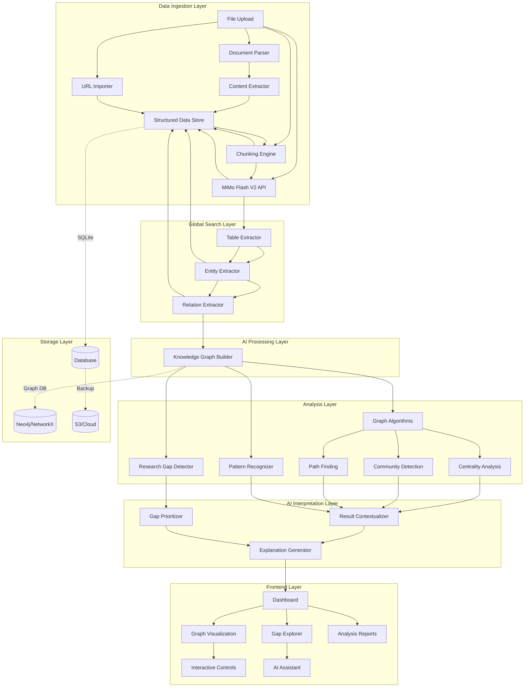

# Enhanced Graph Analyser Architecture Plan

## Project Context

**Цель**: Создать приложение для стандартизированного анализа графов в науке, способное:
- Обрабатывать большие объёмы данных (300+ страниц статей по карнитину)
- Анализировать биохимию по содержанию (не только по ключевым словам)
- Использовать ИИ-модель MiMo Flash V2 для быстрой обработки
- Находить Research Gaps с помощью стандартизированных библиотек
- Анализировать текущее состояние + ИИ-интерпретация результатов
- Глобальный поиск публикаций в интернете с их анализом
- Скачивание доступных источников из списка

## Предлагаемая архитектура



## Детальная архитектура по слоям

### 1. Data Ingestion Layer (Слой загрузки данных)

**Компоненты**:
- `FileUploader` - загрузка PDF, DOCX, TXT
- `URLImporter` - импорт по URL (PubMed, Google Scholar, Crossref, Semantic Scholar)
- `DocumentParser` - парсинг документов
- `ContentExtractor` - извлечение текста, таблиц, формул
- `GlobalSearchEngine` - глобальный поиск публикаций
- `PublicationIndexer` - индексация найденных публикаций
- `SourceDownloader` - скачивание доступных источников

**Технологии**:
- PDF.js / pdf-parse для PDF
- mammoth для DOCX
- Cheerio / JSDOM для HTML
- Pandoc для конвертации
- **serpapi** для Google Scholar scraping
- **eutils** для PubMed API
- **Crossref API** для метаданных
- Puppeteer / Playwright для динамического scraping

**API Endpoints**:
```
POST /api/documents/upload
POST /api/documents/import/url
POST /api/documents/batch
GET /api/documents/:id
GET /api/documents/status/:id

# Google Scholar API
POST /api/scholar/search
POST /api/scholar/import
GET /api/scholar/citations/:id

# PubMed API
POST /api/pubmed/search
POST /api/pubmed/import
GET /api/pubmed/abstract/:pmid
GET /api/pubmed/citations/:pmid

# Global Search API
POST /api/search/global
GET /api/search/results/:searchId
POST /api/search/analyze-batch

# Source Download API
POST /api/sources/download
GET /api/sources/status/:downloadId
GET /api/sources/available
```

### 2. AI Processing Layer (Слой ИИ-обработки)

**Компоненты**:
- `ChunkingEngine` - разбиение на смысловые куски (chunking)
- `MiMoClient` - интеграция с MiMo Flash V2 API
- `TableExtractor` - извлечение таблиц из документов
- `EntityExtractor` - извлечение сущностей (белки, гены, метаболиты)
- `RelationExtractor` - извлечение связей (активация, ингибирование, фосфорилирование)
- `KnowledgeGraphBuilder` - построение графа знаний

**Стратегия чанкования**:
- Semantic chunking по параграфам
- Table-aware chunking (сохранять структуру таблиц)
- Formula-aware chunking (сохранять химические формулы)
- Chunk size: 1000-2000 токенов
- Overlap: 200 токенов

**MiMo Flash V2 Integration**:
```
POST /api/ai/analyze
POST /api/ai/extract-tables
POST /api/ai/extract-entities
POST /api/ai/extract-relations
GET /api/ai/status/:jobId
```

### 3. Analysis Layer (Слой анализа)

**Компоненты**:
- `GraphAnalyzer` - анализ графов (уже есть, расширить)
- `CentralityAnalyzer` - центральность (degree, betweenness, closeness, eigenvector)
- `CommunityDetector` - обнаружение сообществ (Louvain, Leiden)
- `PathFinder` - поиск путей (Dijkstra, BFS, A*)
- `ResearchGapDetector` - детектор пробелов в исследованиях
- `PatternRecognizer` - распознавание паттернов

**Алгоритмы для Research Gaps**:
1. **Structural Gap Detection**:
   - Low density regions в графе
   - Bridges и articulation points
   - Isolated clusters

2. **Temporal Gap Detection**:
   - Цитационные дыры (мало недавних цитирований)
   - Emerging trends analysis
   - Publication velocity tracking

3. **Content-Based Gap Detection**:
   - Contradiction detection (противоречивые результаты)
   - Methodology gaps (отсутствующие подходы)
   - Cross-domain opportunities (междисциплинарные связи)

**Стандартизированные библиотеки**:
- **NetworkX** (Python) - для графовых алгоритмов
- **iGraph** (C) - для больших графов
- **Graphology** (JavaScript) - для frontend визуализации
- **RDKit** - для химических структур
- **BioPython** - для биологических данных

### 4. AI Interpretation Layer (Слой ИИ-интерпретации)

**Компоненты**:
- `ResultContextualizer` - контекстуализация результатов
- `GapPrioritizer` - приоритизация пробелов
- `ExplanationGenerator` - генерация объяснений
- `InsightEngine` - движок инсайтов

**Возможности ИИ**:
1. **Result Interpretation**:
   - "Центральный узел X важен потому что..."
   - "Связь между X и Y указывает на..."
   - "Паттерн Z предполагает..."

2. **Gap Prioritization**:
   - Impact score (влияние на поле)
   - Feasibility score (сложность исследования)
   - Novelty score (новизна)
   - Resource requirements

3. **Methodology Recommendations**:
   - Suggested approaches для каждого gap
   - Required tools и protocols
   - Expected timeline

4. **Text Generation с методологией**:
   - Генерация текста по научной методологии
   - Соблюдение ограничений токенов (chunking для интерпретации и отчёта)
   - Структурированные отчёты с аргументацией
   - Цитирование источников и ссылок на литературу
   - Разбивка на смысловые части для больших отчётов
   - Генерация в несколько итераций с уточнениями

### 5. Frontend Layer (Слой интерфейса)

**Компоненты**:
- `Dashboard` - главная панель с overview
- `GraphVisualization` - интерактивная визуализация (расширить существующий)
- `GapExplorer` - explorer для research gaps
- `AnalysisReports` - отчёты по анализу
- `AIAssistant` - чат-помощник

**Улучшения визуализации**:
1. **Force-directed layout** с настройками:
   - Repulsion force
   - Link distance
   - Gravity
   - Clustering

2. **Biochemistry-specific visualisations**:
   - Pathway diagrams (KEGG, Reactome)
   - Protein interaction networks
   - Metabolic pathway maps
   - Chemical structure rendering
   - Drug-target interaction networks
   - Disease-gene association networks
   - Medical interpretation (связь карнитина с заболеваниями и лекарствами)

3. **Interactive features**:
   - Hover tooltips с детальной информацией
   - Click-to-expand для узлов
   - Filter by entity type
   - Time slider для временных данных
   - Search по контенту
   - **Methodologically sound graphs** - построение в соответствии с методологией
   - **Reproducibility** - сохранение процесса построения и анализа графа
   - **Scientific export formats** - экспорт в форматы для научных журналов (Cytoscape, GraphML, PDF)

### 6. Storage Layer (Слой хранения)

**Компоненты**:
- `SQLite` - для метаданных и быстрых запросов
- `Graph Database` - Neo4j или NetworkX для больших графов
- `Document Store` - S3 или локальное хранилище
- `Cache Layer` - Redis для кэширования

**Схема базы данных**:
```
documents (SQLite)
├── id
├── title
├── content (full text)
├── extracted_tables (JSON)
├── entities (JSON)
├── relations (JSON)
├── source_url
├── processed_at
└── status

graphs (Graph DB)
├── nodes (proteins, genes, metabolites)
├── edges (interactions)
├── properties (weights, types)
└── metadata

gaps (SQLite)
├── id
├── description
├── priority_score
├── feasibility_score
├── novelty_score
├── suggested_approaches
├── related_entities
└── created_at

publications (SQLite)
├── id
├── title
├── abstract
├── authors
├── year
├── journal
├── citations_count
├── url
├── source (scholar, pubmed)
├── analysis_status
├── gap_analysis
└── created_at
```

## Methodology (Методология)

### 1. Data Collection Phase

```
Вход: 300+ PDF документов + глобальный поиск
↓
Парсинг → извлечение текста, таблиц, формул
↓
Чанкование → семантические куски (1000-2000 токенов)
↓
MiMo V2 → параллельная обработка чанков
↓
Агрегация → таблицы, сущности, связи
↓
Индексация → глобальный индекс публикаций
```

### 2. Analysis Phase

```
Граф знаний → NetworkX/Graphology
↓
Алгоритмы:
- Центральность (degree, betweenness, closeness, eigenvector)
- Сообщества (Louvain, Leiden)
- Пути (Dijkstra, BFS)
↓
Research Gap Detection:
- Structural gaps (low density)
- Temporal gaps (citation holes)
- Content gaps (contradictions)
```

### 3. Interpretation Phase

```
Результаты анализа + контекст
↓
ИИ-интерпретация:
- Объяснение центральности
- Приоритизация gaps
- Рекомендации методологии
↓
Инсайты:
- "Белок X - ключевой регулятор..."
- "Обнаружен паттерн Z..."
- "Рекомендуется изучить..."
```

## Технологический стек

### Backend
```
Node.js + Express
├── SQLite (метаданные)
├── NetworkX/Graphology (графы)
├── MiMo Flash V2 API (ИИ)
├── RDKit (химия)
└── BioPython (биология)
```

### Frontend
```
React + TypeScript
├── Vite (build tool)
├── D3.js / Cytoscape.js (графы)
├── Three.js (3D визуализация)
├── Plotly.js (графики)
└── Tailwind CSS (стили)
```

### AI/ML
```
MiMo Flash V2 (внешний API)
├── Table extraction
├── Entity extraction
├── Relation extraction
└── Result interpretation
```

## Implementation Priority

### Phase 1: Foundation (Фундамент)
1. ✅ Исправить существующие баги (сделано)
2. ⬜ Настроить MiMo Flash V2 интеграцию
3. ⬜ Реализовать Document Parser для PDF/DOCX
4. ⬜ Создать Chunking Engine
5. ⬜ Расширить Graph Visualization

### Phase 2: Core Features (Основные функции)
1. ⬜ Table Extractor с MiMo
2. ⬜ Entity Extractor (белки, гены, метаболиты)
3. ⬜ Relation Extractor (типы связей)
4. ⬜ Knowledge Graph Builder
5. ⬜ Research Gap Detector (базовый)

### Phase 3: Advanced Features (Продвинутые функции)
1. ⬜ Community Detection (Louvain)
2. ⬜ Advanced Gap Detection (temporal, content-based)
3. ⬜ AI Interpretation Engine
4. ⬜ Gap Prioritization System
5. ⬜ Methodology Recommendations

### Phase 4: New Features (Новые функции)
1. ⬜ Global Search Engine (поиск публикаций)
2. ⬜ Publication Indexer (индексация)
3. ⬜ Source Downloader (скачивание)
4. ⬜ Batch Analysis (анализ списков)

### Phase 5: Optimization (Оптимизация)
1. ⬜ Performance tuning (кэширование, индексы)
2. ⬜ Batch processing для больших объёмов
3. ⬜ Incremental updates
4. ⬜ Export в форматы (Cytoscape, GraphML)
5. ⬜ Documentation

## API Design

### Document Processing API
```
POST /api/documents/upload
  Body: multipart/form-data (file)
  Response: { documentId, status, chunksCount }

GET /api/documents/:id/tables
  Response: { tables: [...] }

GET /api/documents/:id/entities
  Response: { entities: [...] }

GET /api/documents/:id/relations
  Response: { relations: [...] }
```

### Analysis API
```
POST /api/analyze/centrality
  Body: { graphId, algorithm }
  Response: { results: [...] }

POST /api/analyze/communities
  Body: { graphId, algorithm, resolution }
  Response: { communities: [...] }

POST /api/analyze/gaps
  Body: { graphId, methods: [...] }
  Response: { gaps: [...], insights: [...] }
```

### AI Assistant API
```
POST /api/ai/chat
  Body: { message, context }
  Response: { reply, sources, confidence }

POST /api/ai/explain
  Body: { result, graphContext }
  Response: { explanation, methodology }
```

### Global Search API
```
POST /api/search/global
  Body: { query, sources: [...], filters }
  Response: { searchId, results: [...] }

GET /api/search/results/:searchId
  Response: { results: [...], status }

POST /api/search/analyze-batch
  Body: { publicationIds }
  Response: { analysis: [...] }
```

### Source Download API
```
POST /api/sources/download
  Body: { sourceIds: [...] }
  Response: { downloadId, status }

GET /api/sources/status/:downloadId
  Response: { status, progress, url }

GET /api/sources/available
  Response: { sources: [...] }
```

## Performance Considerations

1. **Chunking Strategy**:
   - Размер чанка: 1000-2000 токенов
   - Overlap: 200 токенов
   - Сохранять структуру таблиц

2. **Caching**:
   - Кэшировать результаты MiMo API
   - Кэшировать графовые вычисления
   - TTL: 1 час для часто запрашиваемых данных

3. **Batch Processing**:
   - Обработка документов партиями по 10-20
   - Параллельная обработка чанков
   - Progress tracking для UI

4. **Incremental Updates**:
   - Добавлять новые документы без полной переработки
   - Обновлять граф инкрементально
   - Сохранять промежуточные результаты

## Success Metrics

1. **Processing Speed**:
   - 300 страниц < 5 минут
   - Табличное извлечение < 30 сек/страница
   - Графовый анализ < 1 минуты

2. **Accuracy**:
   - Entity extraction F1 > 0.85
   - Relation extraction F1 > 0.80
   - Gap detection precision > 0.75

3. **User Experience**:
   - Время отклика < 2 секунды
   - Визуализация > 60 FPS
   - Интерактивность без лагов

## Next Steps

1. Получить доступ к MiMo Flash V2 API
2. Настроить окружение для Python (NetworkX, RDKit)
3. Реализовать Document Parser
4. Создать интеграционные тесты
5. Начать с Phase 1 (Foundation)
