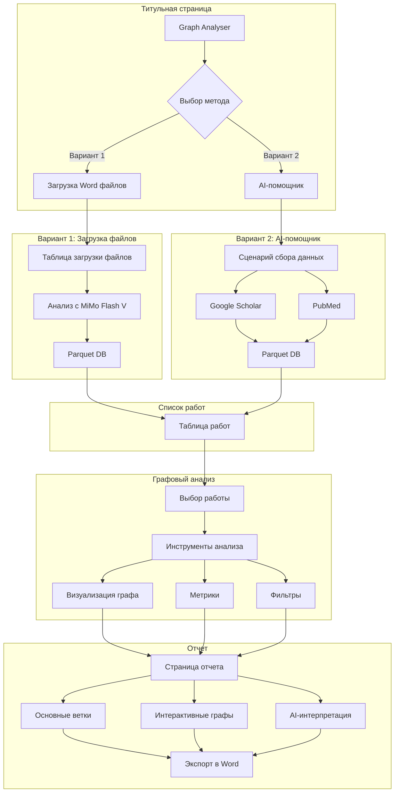
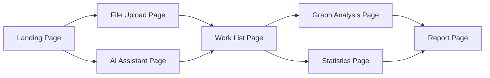
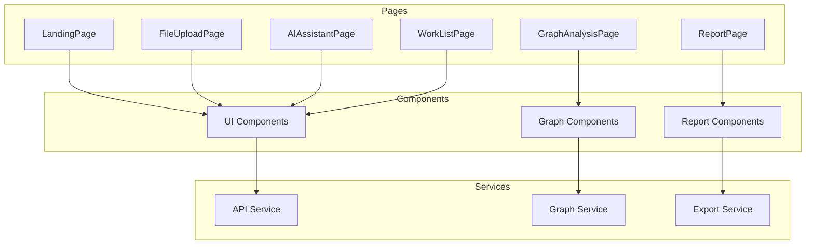

# Радикальный план переделки интерфейса Graph Analyser

## Обзор

Этот план описывает радикальную переделку интерфейса приложения Graph Analyser на основе новых требований. Основной фокус - создание научного приложения с четким рабочим процессом: загрузка данных → анализ → таблица работ → графовый анализ → отчет.

## Новый рабочий процесс (Workflow)



## Архитектура приложения

### Основные страницы



## Детальное описание страниц

### 1. Титульная страница (Landing Page)

**Назначение:** Выбор метода начала работы

**Дизайн:**
- Минималистичный заголовок "Graph Analyser"
- Две крупные карточки с выбором метода
- Современный, профессиональный вид

**Структура:**
```
┌─────────────────────────────────────────────────┐
│                                                 │
│              Graph Analyser                      │
│         Анализ научных публикаций               │
│                                                 │
├─────────────────────────────────────────────────┤
│                                                 │
│  ┌─────────────────────┐  ┌──────────────────┐ │
│  │   📁 Загрузка Word   │  │  🤖 AI-помощник │ │
│  │                     │  │                  │ │
│  │ Загрузите свои       │  │ Используйте ИИ   │ │
│  │ файлы для анализа   │  │ для сбора данных │ │
│  │                     │  │ из Google Scholar │ │
│  │ [Начать загрузку]   │  │ и PubMed         │ │
│  └─────────────────────┘  │ [Начать сбор]     │ │
│                          └──────────────────┘ │
│                                                 │
└─────────────────────────────────────────────────┘
```

**Компоненты:**
- `LandingPage.tsx` - Главная страница
- `MethodCard.tsx` - Карточка выбора метода

**Состояния:**
- Выбор метода загрузки данных

### 2. Страница загрузки файлов (File Upload Page)

**Назначение:** Загрузка Word файлов для анализа с использованием MiMo Flash V

**Дизайн:**
- Drag-and-drop зона для загрузки файлов
- Таблица загруженных файлов с прогрессом
- Кнопка запуска анализа
- Статус обработки каждого файла

**Структура:**
```
┌─────────────────────────────────────────────────┐
│ ← Назад    Загрузка файлов для анализа        │
├─────────────────────────────────────────────────┤
│                                                 │
│  ┌─────────────────────────────────────────┐   │
│  │  Перетащите файлы сюда или           │   │
│  │  [Выбрать файлы]                      │   │
│  │                                        │   │
│  │  Поддерживаемые форматы: .docx, .doc  │   │
│  └─────────────────────────────────────────┘   │
│                                                 │
│  Загруженные файлы:                             │
│  ┌──────────────────────────────────────────┐  │
│  │ # │ Имя файла            │ Статус       │  │
│  ├──┼──────────────────────┼──────────────┤  │
│  │ 1 │ article1.docx       │ ✅ Анализ    │  │
│  │ 2 │ article2.docx       │ ⏳ Обработка │  │
│  │ 3 │ article3.docx       │ ⏸️ Ожидание  │  │
│  └──────────────────────────────────────────┘  │
│                                                 │
│  [Анализировать все]  [Очистить]               │
│                                                 │
└─────────────────────────────────────────────────┘
```

**Компоненты:**
- `FileUploadPage.tsx` - Страница загрузки
- `FileDropzone.tsx` - Зона перетаскивания
- `FileTable.tsx` - Таблица файлов
- `FileStatusBadge.tsx` - Бейдж статуса файла
- `AnalysisProgress.tsx` - Прогресс анализа

**Функциональность:**
- Drag-and-drop загрузка .docx файлов
- Отображение списка загруженных файлов
- Статус каждого файла (ожидание, обработка, анализ, готово, ошибка)
- Прогресс-бар для каждого файла
- Кнопка запуска анализа всех файлов
- Удаление файлов из списка
- Интеграция с MiMo Flash V для анализа

### 3. Страница AI-помощника (AI Assistant Page)

**Назначение:** Создание сценария сбора данных с помощью ИИ из Google Scholar и/или PubMed

**Дизайн:**
- Чат-интерфейс с AI-помощником
- Форма для ввода запроса
- Выбор источников (Google Scholar, PubMed)
- Настройки параметров поиска
- Предпросмотр найденных статей
- Кнопка сохранения в Parquet DB

**Структура:**
```
┌─────────────────────────────────────────────────┐
│ ← Назад    AI-помощник для сбора данных       │
├─────────────────────────────────────────────────┤
│                                                 │
│  ┌─────────────────────────────────────────┐   │
│  │ Источники:                            │   │
│  │ ☑ Google Scholar  ☑ PubMed            │   │
│  │                                        │   │
│  │ Параметры поиска:                      │   │
│  │ Ключевые слова: [_____________]         │   │
│  │ Год с: [2020] по: [2024]             │   │
│  │ Макс. статей: [100]                   │   │
│  │                                        │   │
│  │ [Создать сценарий]                     │   │
│  └─────────────────────────────────────────┘   │
│                                                 │
│  ┌─────────────────────────────────────────┐   │
│  │ 💬 AI-помощник                        │   │
│  │                                        │   │
│  │ 🤖: Привет! Я помогу вам собрать       │   │
│  │     данные из Google Scholar и PubMed. │   │
│  │     Введите ваш запрос или тему        │   │
│  │     исследования.                     │   │
│  │                                        │   │
│  │ 👤: P53 signaling pathway in cancer     │   │
│  │                                        │   │
│  │ 🤖: Отлично! Я нашел 47 статей по     │   │
│  │     этой теме. Хотите увидеть список? │   │
│  │     [Да] [Нет]                        │   │
│  │                                        │   │
│  │ [Введите сообщение...]                  │   │
│  └─────────────────────────────────────────┘   │
│                                                 │
│  Найденные статьи:                             │
│  ┌──────────────────────────────────────────┐  │
│  │ ☑ P53 signaling pathway...    2023     │  │
│  │ ☑ MDM2 regulation mechanisms... 2022   │  │
│  │ ☑ AKT1 network analysis...    2024   │  │
│  └──────────────────────────────────────────┘  │
│                                                 │
│  [Сохранить в Parquet DB]  [Экспорт CSV]       │
│                                                 │
└─────────────────────────────────────────────────┘
```

**Компоненты:**
- `AIAssistantPage.tsx` - Страница AI-помощника
- `ChatInterface.tsx` - Чат-интерфейс
- `SourceSelector.tsx` - Выбор источников
- `SearchForm.tsx` - Форма поиска
- `ArticleList.tsx` - Список найденных статей
- `ArticlePreview.tsx` - Превью статьи

**Функциональность:**
- Чат с AI-помощником
- Выбор источников данных (Google Scholar, PubMed)
- Настройка параметров поиска
- Отображение найденных статей
- Выбор статей для сохранения
- Сохранение в Parquet DB
- Экспорт в CSV

### 4. Страница "Список работ" (Work List Page)

**Назначение:** Таблица всех проанализированных работ с доступом к графовому анализу

**Дизайн:**
- Большая интерактивная таблица
- Фильтрация и сортировка
- Поиск по работам
- Действия для каждой работы (анализ, удалить, экспорт)
- Пагинация
- Статистика вверху страницы

**Структура:**
```
┌─────────────────────────────────────────────────┐
│  Список работ                    [Новая работа]│
├─────────────────────────────────────────────────┤
│                                                 │
│  Статистика:                                   │
│  ┌──────┐ ┌──────┐ ┌──────┐ ┌──────┐         │
│  │Всего │ │Анализ│ │В черновике│ │Экспорт│      │
│  │  47  │ │  38  │ │    5    │ │  4   │       │
│  └──────┘ └──────┘ └──────┘ └──────┘         │
│                                                 │
│  🔍 Поиск: [________________]  Фильтр: [▼]     │
│                                                 │
│  ┌──────────────────────────────────────────┐   │
│  │ ☑ │ ID │ Название              │ Статус │   │
│  ├──┼────┼──────────────────────┼────────┤   │
│  │ ☑ │001 │ P53 signaling...   │ ✅     │   │
│  │ ☑ │002 │ MDM2 regulation... │ ✅     │   │
│  │ ☑ │003 │ AKT1 network...   │ ⏳     │   │
│  └──────────────────────────────────────────┘   │
│                                                 │
│  [Анализировать выбранные]  [Удалить]          │
│                                                 │
│  ← 1 2 3 4 5 →                                │
│                                                 │
└─────────────────────────────────────────────────┘
```

**Компоненты:**
- `WorkListPage.tsx` - Страница списка работ
- `WorkTable.tsx` - Таблица работ
- `WorkRow.tsx` - Строка таблицы
- `WorkStatusBadge.tsx` - Бейдж статуса
- `WorkActions.tsx` - Действия с работой
- `WorkFilters.tsx` - Фильтры работ
- `WorkPagination.tsx` - Пагинация

**Функциональность:**
- Отображение всех работ в таблице
- Фильтрация по статусу, дате, ключевым словам
- Сортировка по любому столбцу
- Поиск по названию
- Выбор нескольких работ
- Массовые действия (анализ, удалить, экспорт)
- Пагинация
- Переход к графовому анализу выбранной работы

### 5. Страница графового анализа (Graph Analysis Page)

**Назначение:** Стандартизированный инструментарий для анализа графов как в других научных приложениях

**Дизайн:**
- Большая область визуализации графа
- Панель инструментов слева или справа
- Mini-map для навигации
- Панель свойств выбранного элемента
- Панель фильтров
- Панель метрик

**Структура:**
```
┌─────────────────────────────────────────────────┐
│ ← Список работ  Анализ: P53 signaling...      │
├──────────┬──────────────────────────────────────┤
│          │                                      │
│ Инструменты│        Граф                       │
│ ┌──────┐ │  ┌──────────────────────────┐      │
│ │🔍Поиск│ │  │                        │      │
│ └──────┘ │  │        [Граф]           │      │
│          │  │                        │      │
│ Фильтры  │  │                        │      │
│ ┌──────┐ │  │                        │      │
│ │Тип   │ │  │                        │      │
│ │☑Белки│ │  │                        │      │
│ │☑Гены │ │  │                        │      │
│ │☐Мет. │ │  │                        │      │
│ └──────┘ │  │                        │      │
│          │  │                        │      │
│ Layout   │  │                        │      │
│ [Force]  │  │                        │      │
│ [Circ.]  │  │                        │      │
│ [Hier.]  │  │                        │      │
│          │  └──────────────────────────┘      │
│ Метрики  │                                      │
│ ┌──────┐ │    Свойства узла                   │
│ │Deg:45 │ │    ┌──────────────────┐          │
│ │Bet:.85│ │    │ P53             │          │
│ │Clo:.72│ │    │ Тип: Белок      │          │
│ └──────┘ │    │ Степень: 45     │          │
│          │    │ Betweenness: .85 │          │
│ [Zoom+]  │    └──────────────────┘          │
│ [Zoom-]  │                                      │
│ [Reset]  │    Mini-map                           │
│          │    ┌────┐                             │
│          │    │░░░░│                             │
│          │    │░░░░│                             │
│          │    └────┘                             │
│          │                                      │
└──────────┴──────────────────────────────────────┘
```

**Компоненты:**
- `GraphAnalysisPage.tsx` - Страница анализа
- `GraphCanvas.tsx` - Канва для графа
- `GraphToolbar.tsx` - Панель инструментов
- `GraphFilters.tsx` - Панель фильтров
- `GraphMetrics.tsx` - Панель метрик
- `GraphProperties.tsx` - Свойства элемента
- `MiniMap.tsx` - Мини-карта
- `GraphSearch.tsx` - Поиск по графу

**Функциональность:**
- Визуализация графа с различными layout алгоритмами
- Zoom, pan, rotate
- Выбор узлов и ребер
- Фильтрация по типу, атрибутам
- Поиск по узлам
- Расчет метрик (degree, betweenness, closeness, etc.)
- Экспорт графа в различных форматах (GEXF, GraphML, JSON, PNG)
- Mini-map для навигации
- Выделение путей между узлами
- Выделение сообществ

### 6. Страница отчета (Report Page)

**Назначение:** Вертикально прокручиваемая страница с основными ветками, интерактивными графами и AI-интерпретацией

**Дизайн:**
- Вертикальная прокрутка
- Секции с основными результатами
- Встроенные интерактивные графы
- Секция AI-интерпретации
- Кнопка экспорта в Word

**Структура:**
```
┌─────────────────────────────────────────────────┐
│ ← Анализ    Отчет: P53 signaling pathway     │
│                      [Экспорт в Word]         │
├─────────────────────────────────────────────────┤
│                                                 │
│  1. Основные результаты                        │
│  ┌─────────────────────────────────────────┐   │
│  │ • Всего проанализировано статей: 47    │   │
│  │ • Найдено сущностей: 2,513            │   │
│  │ • Выявлено взаимодействий: 4,582      │   │
│  │ • Найдено сообществ: 23               │   │
│  └─────────────────────────────────────────┘   │
│                                                 │
│  2. Графовая визуализация                       │
│  ┌─────────────────────────────────────────┐   │
│  │        [Интерактивный граф]            │   │
│  │                                        │   │
│  │                                        │   │
│  │                                        │   │
│  └─────────────────────────────────────────┘   │
│                                                 │
│  3. Топ сущностей по центральности              │
│  ┌─────────────────────────────────────────┐   │
│  │ 1. P53 (degree: 45, betweenness: .85)  │   │
│  │ 2. ATM (degree: 52, betweenness: .91)  │   │
│  │ 3. MDM2 (degree: 38, betweenness: .72) │   │
│  └─────────────────────────────────────────┘   │
│                                                 │
│  4. Выявленные сообщества                     │
│  ┌─────────────────────────────────────────┐   │
│  │ Сообщество 1: P53-MDM2-ATM (12 узлов) │   │
│  │ Сообщество 2: EGFR-Ras-Raf (8 узлов)   │   │
│  │ Сообщество 3: PTEN-AKT1 (5 узлов)      │   │
│  └─────────────────────────────────────────┘   │
│                                                 │
│  5. AI-интерпретация                           │
│  ┌─────────────────────────────────────────┐   │
│  │ 🤖 Анализ результатов:                │   │
│  │                                        │   │
│  │ На основе анализа 47 статей по теме    │   │
│  │ P53 signaling pathway в онкологии,    │   │
│  │ выявлено несколько ключевых находок:   │   │
│  │                                        │   │
│  │ 1. P53 является центральным узлом в    │   │
│  │    сети с высокой степенью (45) и      │   │
│  │    betweenness (0.85), что указывает   │   │
│  │    на его ключевую роль в регуляции    │   │
│  │    клеточного цикла.                  │   │
│  │                                        │   │
│  │ 2. Выявлено 3 основных сообщества,     │   │
│  │    которые соответствуют известным      │   │
│  │    путям регуляции апоптоза и         │   │
│  │    клеточного роста.                   │   │
│  │                                        │   │
│  │ 3. Обнаружено несколько потенциальных   │   │
│  │    исследовательских пробелов:         │   │
│  │    - Взаимодействия P53 с метаболи-   │   │
│  │      ческими путями изучены недостаточно│   │
│  │    - Роль ATM в регуляции P53 в       │   │
│  │      контексте химиотерапии требует    │   │
│  │      дальнейшего изучения              │   │
│  │                                        │   │
│  └─────────────────────────────────────────┘   │
│                                                 │
│  6. Рекомендации для публикации                  │
│  ┌─────────────────────────────────────────┐   │
│  │ • Фокус на P53-MDM2-ATM пути как       │   │
│  │   основном объекте исследования          │   │
│  │ • Рассмотреть метаболические связи      │   │
│  │   как потенциальный research gap        │   │
│  │ • Включить количественный анализ       │   │
│  │   центральности для статистической     │   │
│  │   валидации                           │   │
│  └─────────────────────────────────────────┘   │
│                                                 │
└─────────────────────────────────────────────────┘
```

**Компоненты:**
- `ReportPage.tsx` - Страница отчета
- `ReportSection.tsx` - Секция отчета
- `ResultsSummary.tsx` - Сводка результатов
- `InteractiveGraph.tsx` - Интерактивный граф в отчете
- `TopEntities.tsx` - Топ сущностей
- `Communities.tsx` - Сообщества
- `AIInterpretation.tsx` - AI-интерпретация
- `Recommendations.tsx` - Рекомендации
- `ExportToWord.tsx` - Кнопка экспорта в Word

**Функциональность:**
- Вертикальная прокрутка
- Секции с результатами анализа
- Встроенные интерактивные графы
- AI-интерпретация результатов
- Рекомендации для публикации
- Экспорт в Word (.docx)
- Экспорт в PDF
- Печать

## Техническая архитектура

### Backend

```mermaid
graph TB
    subgraph "API Routes"
        A[/upload] --> B[File Upload Service]
        C[/ai-assistant] --> D[AI Service]
        E[/works] --> F[Work Service]
        G[/analysis] --> H[Graph Analysis Service]
        I[/report] --> J[Report Service]
    end
    
    subgraph "Services"
        B --> K[MiMo Flash V Integration]
        D --> L[Google Scholar API]
        D --> M[PubMed API]
        H --> N[Graph Algorithms]
        J --> O[Word Generation]
    end
    
    subgraph "Storage"
        K --> P[(Parquet DB)]
        L --> P
        M --> P
        N --> P
    end
```

### Frontend



## Необходимые библиотеки

### Frontend
```json
{
  "dependencies": {
    "react": "^18.3.1",
    "react-router-dom": "^6.20.0",
    "lucide-react": "^0.300.0",
    "recharts": "^2.10.0",
    "framer-motion": "^10.16.0",
    "react-hot-toast": "^2.4.0",
    "clsx": "^2.0.0",
    "tailwind-merge": "^2.0.0",
    "d3": "^7.8.5",
    "cytoscape": "^3.26.0",
    "vis-network": "^9.1.6",
    "docx": "^8.2.2",
    "jspdf": "^2.5.1"
  }
}
```

### Backend
```json
{
  "dependencies": {
    "express": "^4.19.2",
    "multer": "^1.4.5-lts.1",
    "mammoth": "^1.6.0",
    "parquetjs": "^0.11.0",
    "axios": "^1.6.2",
    "cheerio": "^1.0.0-rc.12",
    "openai": "^4.20.0",
    "docxtemplater": "^3.37.12",
    "pizzip": "^3.1.4"
  }
}
```

## План реализации

### Этап 1: Базовая инфраструктура (2-3 дня)
- [ ] Установить необходимые библиотеки
- [ ] Создать дизайн-систему (colors, typography, spacing)
- [ ] Создать базовые UI компоненты (Button, Input, Card, Modal)
- [ ] Настроить маршрутизацию
- [ ] Создать новый Layout

### Этап 2: Титульная страница (1 день)
- [ ] Создать LandingPage.tsx
- [ ] Создать MethodCard.tsx
- [ ] Настроить маршруты к FileUploadPage и AIAssistantPage

### Этап 3: Страница загрузки файлов (2-3 дня)
- [ ] Создать FileUploadPage.tsx
- [ ] Создать FileDropzone.tsx
- [ ] Создать FileTable.tsx
- [ ] Создать FileStatusBadge.tsx
- [ ] Создать AnalysisProgress.tsx
- [ ] Интеграция с MiMo Flash V
- [ ] Сохранение в Parquet DB

### Этап 4: Страница AI-помощника (3-4 дня)
- [ ] Создать AIAssistantPage.tsx
- [ ] Создать ChatInterface.tsx
- [ ] Создать SourceSelector.tsx
- [ ] Создать SearchForm.tsx
- [ ] Создать ArticleList.tsx
- [ ] Создать ArticlePreview.tsx
- [ ] Интеграция с Google Scholar API
- [ ] Интеграция с PubMed API
- [ ] Интеграция с OpenAI API
- [ ] Сохранение в Parquet DB

### Этап 5: Страница "Список работ" (2-3 дня)
- [ ] Создать WorkListPage.tsx
- [ ] Создать WorkTable.tsx
- [ ] Создать WorkRow.tsx
- [ ] Создать WorkStatusBadge.tsx
- [ ] Создать WorkActions.tsx
- [ ] Создать WorkFilters.tsx
- [ ] Создать WorkPagination.tsx
- [ ] Интеграция с Parquet DB

### Этап 6: Страница графового анализа (4-5 дней)
- [ ] Создать GraphAnalysisPage.tsx
- [ ] Создать GraphCanvas.tsx (используя Cytoscape.js или vis-network)
- [ ] Создать GraphToolbar.tsx
- [ ] Создать GraphFilters.tsx
- [ ] Создать GraphMetrics.tsx
- [ ] Создать GraphProperties.tsx
- [ ] Создать MiniMap.tsx
- [ ] Создать GraphSearch.tsx
- [ ] Реализовать layout алгоритмы
- [ ] Реализовать метрики (degree, betweenness, closeness)
- [ ] Реализовать экспорт (GEXF, GraphML, JSON, PNG)

### Этап 7: Страница отчета (3-4 дня)
- [ ] Создать ReportPage.tsx
- [ ] Создать ReportSection.tsx
- [ ] Создать ResultsSummary.tsx
- [ ] Создать InteractiveGraph.tsx
- [ ] Создать TopEntities.tsx
- [ ] Создать Communities.tsx
- [ ] Создать AIInterpretation.tsx
- [ ] Создать Recommendations.tsx
- [ ] Создать ExportToWord.tsx
- [ ] Реализовать генерацию Word документа
- [ ] Реализовать экспорт в PDF

### Этап 8: Backend интеграция (3-4 дня)
- [ ] Создать API routes для всех страниц
- [ ] Интеграция с MiMo Flash V
- [ ] Интеграция с Google Scholar API
- [ ] Интеграция с PubMed API
- [ ] Интеграция с OpenAI API
- [ ] Работа с Parquet DB
- [ ] Генерация Word документов

### Этап 9: Тестирование и полировка (2-3 дня)
- [ ] Тестирование всех страниц
- [ ] Тестирование интеграций
- [ ] Проверка адаптивности
- [ ] Исправление багов
- [ ] Оптимизация производительности

### Этап 10: Документация (1 день)
- [ ] Документация компонентов
- [ ] Руководство по использованию
- [ ] README с инструкциями

## Общее время реализации

**Оценка:** 20-25 дней

## Ключевые особенности нового дизайна

1. **Четкий рабочий процесс** - от загрузки данных до отчета
2. **Стандартизированные инструменты** - как в других научных приложениях
3. **Интерактивные графы** - в отчете и на странице анализа
4. **AI-интеграция** - для сбора данных и интерпретации результатов
5. **Parquet DB** - для хранения данных
6. **Экспорт в Word** - для публикации результатов

## Заключение

Этот план обеспечивает радикальную переделку интерфейса Graph Analyser с новым рабочим процессом, ориентированным на научные исследования. Основной фокус - создание профессионального инструмента для анализа научных публикаций с интеграцией AI и стандартизированным набором инструментов графового анализа.
