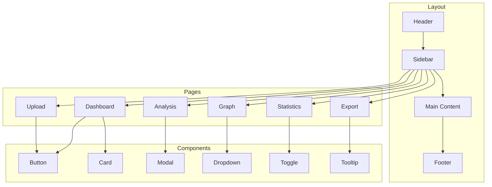

# План переделки UI/UX: Современный минималистичный дизайн

## Обзор

Этот план описывает полную переделку интерфейса приложения Graph Analyser с фокусом на современный, минималистичный дизайн с улучшенной UX. Цель - создать чистый, интуитивный интерфейс, который легко использовать и который выглядит профессионально.

## Текущие проблемы интерфейса

### 1. Перегруженная навигация
- **Проблема:** 7 пунктов меню в заголовке, все видны одновременно
- **Решение:** Свернуть в боковую панель или выпадающее меню

### 2. HomePage слишком длинная и перегруженная
- **Проблема:** 605 строк кода, слишком много контента на одной странице
- **Решение:** Разделить на логические секции, использовать модальные окна

### 3. Отсутствие визуальной иерархии
- **Проблема:** Все элементы имеют одинаковый визуальный вес
- **Решение:** Использовать размер, цвет и отступы для создания иерархии

### 4. Неудачная цветовая палитра
- **Проблема:** Слишком много разных цветов (blue, purple, green, orange)
- **Решение:** Использовать ограниченную палитру с акцентным цветом

### 5. Отсутствие пустого пространства (whitespace)
- **Проблема:** Элементы расположены слишком плотно
- **Решение:** Увеличить отступы между элементами

### 6. Непрофессиональные иконки (эмодзи)
- **Проблема:** Использование эмодзи вместо SVG иконок
- **Решение:** Заменить на профессиональные SVG иконки (lucide-react, heroicons)

### 7. Отсутствие темной темы
- **Проблема:** Только светлая тема
- **Решение:** Добавить переключатель темы

### 8. Неудачные компоненты
- **Проблема:** FileUploader выглядит устаревшим
- **Решение:** Современный drag-and-drop с визуальной обратной связью
- **Проблема:** GraphViewer использует базовый SVG без анимаций
- **Решение:** Добавить плавные анимации и переходы

## Новая дизайн-система

### Цветовая палитра

```typescript
// Основные цвета
const colors = {
  // Светлая тема
  light: {
    background: '#ffffff',
    surface: '#f8fafc',
    surfaceHover: '#f1f5f9',
    border: '#e2e8f0',
    text: {
      primary: '#0f172a',
      secondary: '#475569',
      tertiary: '#94a3b8'
    }
  },
  
  // Темная тема
  dark: {
    background: '#0f172a',
    surface: '#1e293b',
    surfaceHover: '#334155',
    border: '#334155',
    text: {
      primary: '#f8fafc',
      secondary: '#cbd5e1',
      tertiary: '#64748b'
    }
  },
  
  // Акцентный цвет (синий)
  primary: {
    50: '#eff6ff',
    100: '#dbeafe',
    200: '#bfdbfe',
    300: '#93c5fd',
    400: '#60a5fa',
    500: '#3b82f6', // Основной акцентный цвет
    600: '#2563eb',
    700: '#1d4ed8',
    800: '#1e40af',
    900: '#1e3a8a'
  },
  
  // Статусные цвета
  success: '#10b981',
  warning: '#f59e0b',
  error: '#ef4444',
  info: '#3b82f6'
}
```

### Типографика

```typescript
const typography = {
  fontFamily: {
    sans: 'Inter, system-ui, -apple-system, sans-serif',
    mono: 'JetBrains Mono, Fira Code, monospace'
  },
  fontSize: {
    xs: '0.75rem',    // 12px
    sm: '0.875rem',   // 14px
    base: '1rem',     // 16px
    lg: '1.125rem',   // 18px
    xl: '1.25rem',    // 20px
    '2xl': '1.5rem',  // 24px
    '3xl': '1.875rem', // 30px
    '4xl': '2.25rem'  // 36px
  },
  fontWeight: {
    normal: 400,
    medium: 500,
    semibold: 600,
    bold: 700
  },
  lineHeight: {
    tight: 1.25,
    normal: 1.5,
    relaxed: 1.75
  }
}
```

### Отступы (Spacing)

```typescript
const spacing = {
  1: '0.25rem',  // 4px
  2: '0.5rem',   // 8px
  3: '0.75rem',  // 12px
  4: '1rem',     // 16px
  5: '1.25rem',  // 20px
  6: '1.5rem',   // 24px
  8: '2rem',     // 32px
  10: '2.5rem',  // 40px
  12: '3rem',    // 48px
  16: '4rem',    // 64px
  20: '5rem'     // 80px
}
```

### Скругления (Border Radius)

```typescript
const borderRadius = {
  sm: '0.25rem',   // 4px
  md: '0.5rem',    // 8px
  lg: '0.75rem',   // 12px
  xl: '1rem',      // 16px
  '2xl': '1.5rem', // 24px
  full: '9999px'
}
```

### Тени (Shadows)

```typescript
const shadows = {
  sm: '0 1px 2px 0 rgb(0 0 0 / 0.05)',
  md: '0 4px 6px -1px rgb(0 0 0 / 0.1), 0 2px 4px -2px rgb(0 0 0 / 0.1)',
  lg: '0 10px 15px -3px rgb(0 0 0 / 0.1), 0 4px 6px -4px rgb(0 0 0 / 0.1)',
  xl: '0 20px 25px -5px rgb(0 0 0 / 0.1), 0 8px 10px -6px rgb(0 0 0 / 0.1)'
}
```

## Архитектура нового интерфейса



## Детальный план переделки по компонентам

### 1. Layout.tsx - Новый макет приложения

**Текущая проблема:**
- Горизонтальная навигация с 7 пунктами
- Базовый дизайн с emoji иконками

**Новый дизайн:**
- Боковая панель (Sidebar) с collapsible меню
- Профессиональные SVG иконки
- Переключатель темы (светлая/темная)
- Профиль пользователя
- Поиск по приложению

**Структура нового Layout:**
```
┌─────────────────────────────────────────────────┐
│ Header: Logo | Search | Theme Toggle | Profile │
├──────────┬──────────────────────────────────────┤
│          │                                      │
│ Sidebar  │         Main Content                 │
│          │                                      │
│ - Dashboard│                                    │
│ - Upload   │                                    │
│ - Analysis │                                    │
│ - Graph    │                                    │
│ - Stats    │                                    │
│ - Export   │                                    │
│          │                                      │
└──────────┴──────────────────────────────────────┘
```

**Новые компоненты:**
- `Sidebar.tsx` - Боковая панель навигации
- `Header.tsx` - Верхняя панель с поиском и профилем
- `ThemeToggle.tsx` - Переключатель темы
- `UserProfile.tsx` - Профиль пользователя

### 2. HomePage.tsx → Dashboard.tsx

**Текущая проблема:**
- 605 строк кода
- Слишком много контента на одной странице
- Смешаны разные функциональности

**Новый дизайн:**
- Переименовать в `Dashboard.tsx`
- Разделить на логические секции
- Использовать карточки для организации контента
- Добавить быстрый доступ к основным функциям

**Новая структура:**
```
┌─────────────────────────────────────────────────┐
│ Dashboard                                       │
├─────────────────────────────────────────────────┤
│ Quick Stats (4 карточки)                        │
│ ┌──────┐ ┌──────┐ ┌──────┐ ┌──────┐            │
│ │Articles│ │Entities│ │Interactions│ │Graphs│  │
│ └──────┘ └──────┘ └──────┘ └──────┘            │
├─────────────────────────────────────────────────┤
│ Recent Activity (timeline)                      │
│ - Article uploaded: "P53 signaling..."          │
│ - Analysis completed: 47 articles              │
│ - Graph exported: GEXF format                  │
├─────────────────────────────────────────────────┤
│ Quick Actions (кнопки)                          │
│ [Upload New] [Start Analysis] [View Graph]     │
└─────────────────────────────────────────────────┘
```

**Новые компоненты:**
- `StatCard.tsx` - Карточка статистики (улучшенная версия)
- `ActivityTimeline.tsx` - Таймлайн активности
- `QuickActions.tsx` - Быстрые действия
- `RecentArticles.tsx` - Недавние статьи

### 3. FileUploader.tsx

**Текущая проблема:**
- Базовый drag-and-drop
- Отсутствует визуальная обратная связь
- Устаревший дизайн

**Новый дизайн:**
- Современный drag-and-drop с анимациями
- Прогресс загрузки с визуализацией
- Предпросмотр загружаемых файлов
- Поддержка множественной загрузки
- Drag-and-drop зона с hover эффектами

**Новые компоненты:**
- `Dropzone.tsx` - Зона для перетаскивания
- `FilePreview.tsx` - Превью файла
- `UploadProgress.tsx` - Прогресс загрузки
- `FileList.tsx` - Список загруженных файлов

### 4. GraphViewer.tsx

**Текущая проблема:**
- Базовый SVG без анимаций
- Отсутствует интерактивность
- Нет mini-map
- Нет фильтрации узлов

**Новый дизайн:**
- Плавные анимации переходов
- Mini-map для навигации по большому графу
- Фильтрация узлов по типу/атрибутам
- Поиск по узлам
- Экспорт изображения графа
- Различные layout алгоритмы (force, circular, hierarchical)
- Zoom и pan с плавными переходами

**Новые компоненты:**
- `GraphCanvas.tsx` - Канва для отрисовки графа
- `MiniMap.tsx` - Мини-карта
- `GraphControls.tsx` - Панель управления графом
- `NodeFilter.tsx` - Фильтр узлов
- `GraphSearch.tsx` - Поиск по графу
- `GraphExport.tsx` - Экспорт графа

### 5. AnalysisPage.tsx

**Текущая проблема:**
- Фиксированная нижняя панель занимает много места
- Отсутствует детализация прогресса
- Нет возможности отменить анализ

**Новый дизайн:**
- Плавающая панель прогресса (сверху)
- Детальный прогресс по шагам
- Возможность отмены/паузы
- Логирование процесса анализа
- Визуализация результатов в реальном времени

**Новые компоненты:**
- `AnalysisProgress.tsx` - Прогресс анализа
- `AnalysisLog.tsx` - Лог анализа
- `AnalysisResults.tsx` - Результаты анализа
- `AnalysisControls.tsx` - Управление анализом

### 6. StatisticsPage.tsx

**Текущая проблема:**
- Статические карточки
- Нет интерактивных графиков
- Отсутствует фильтрация по времени

**Новый дизайн:**
- Интерактивные графики (Chart.js или Recharts)
- Фильтрация по периоду времени
- Экспорт графиков
- Сравнение с предыдущими периодами
- Детализация по клику

**Новые компоненты:**
- `ChartCard.tsx` - Карточка с графиком
- `TimeFilter.tsx` - Фильтр по времени
- `MetricCard.tsx` - Карточка метрики
- `ComparisonView.tsx` - Сравнительный вид

### 7. ExportDataPage.tsx

**Текущая проблема:**
- Слишком много опций на одной странице
- Неудобный выбор формата
- Нет предпросмотра данных

**Новый дизайн:**
- Пошаговый мастер экспорта (wizard)
- Предпросмотр данных перед экспортом
- Шаблоны экспорта для разных целей
- История экспортов

**Новые компоненты:**
- `ExportWizard.tsx` - Мастер экспорта
- `DataPreview.tsx` - Предпросмотр данных
- `ExportTemplates.tsx` - Шаблоны экспорта
- `ExportHistory.tsx` - История экспортов

## Общие компоненты для создания

### Базовые компоненты
1. **Button.tsx** - Кнопка с вариантами (primary, secondary, ghost, danger)
2. **Input.tsx** - Поле ввода с валидацией
3. **Select.tsx** - Выпадающий список
4. **Checkbox.tsx** - Чекбокс
5. **Radio.tsx** - Радио-кнопка
6. **Toggle.tsx** - Переключатель
7. **Textarea.tsx** - Текстовая область
8. **Badge.tsx** - Бейдж/тег

### Компоненты отображения
9. **Card.tsx** - Карточка контента
10. **Modal.tsx** - Модальное окно
11. **Drawer.tsx** - Выдвижная панель
12. **Tooltip.tsx** - Всплывающая подсказка
13. **Popover.tsx** - Поповер
14. **Dropdown.tsx** - Выпадающее меню
15. **Tabs.tsx** - Табы
16. **Accordion.tsx** - Аккордеон
17. **Skeleton.tsx** - Скелетон для загрузки

### Компоненты обратной связи
18. **Toast.tsx** - Уведомление
19. **Alert.tsx** - Предупреждение
20. **Progress.tsx** - Индикатор прогресса
21. **Spinner.tsx** - Спиннер загрузки

### Компоненты навигации
22. **Breadcrumb.tsx** - Хлебные крошки
23. **Pagination.tsx** - Пагинация
24. **Stepper.tsx** - Шаговый прогресс

## План реализации

### Этап 1: Базовая инфраструктура (1-2 дня)
- [ ] Установить библиотеки иконок (lucide-react)
- [ ] Создать дизайн-систему (colors, typography, spacing)
- [ ] Создать базовые компоненты (Button, Input, Card, Modal)
- [ ] Настроить тему (светлая/темная)
- [ ] Создать новый Layout с Sidebar

### Этап 2: Переделка навигации (1 день)
- [ ] Создать Sidebar.tsx с collapsible меню
- [ ] Создать Header.tsx с поиском и профилем
- [ ] Добавить ThemeToggle.tsx
- [ ] Обновить маршруты для нового layout

### Этап 3: Переделка HomePage → Dashboard (1-2 дня)
- [ ] Создать Dashboard.tsx
- [ ] Создать StatCard.tsx (улучшенная версия)
- [ ] Создать ActivityTimeline.tsx
- [ ] Создать QuickActions.tsx
- [ ] Перенести функциональность из HomePage

### Этап 4: Улучшение FileUploader (1 день)
- [ ] Создать Dropzone.tsx
- [ ] Создать FilePreview.tsx
- [ ] Создать UploadProgress.tsx
- [ ] Добавить поддержку множественной загрузки

### Этап 5: Улучшение GraphViewer (2-3 дня)
- [ ] Добавить анимации в GraphViewer
- [ ] Создать MiniMap.tsx
- [ ] Создать GraphControls.tsx
- [ ] Создать NodeFilter.tsx
- [ ] Создать GraphSearch.tsx
- [ ] Добавить экспорт изображения

### Этап 6: Переделка AnalysisPage (1-2 дня)
- [ ] Создать плавающую панель прогресса
- [ ] Создать AnalysisLog.tsx
- [ ] Добавить возможность отмены/паузы
- [ ] Улучшить визуализацию результатов

### Этап 7: Переделка StatisticsPage (1-2 дня)
- [ ] Установить библиотеку графиков (Recharts)
- [ ] Создать интерактивные графики
- [ ] Создать TimeFilter.tsx
- [ ] Добавить экспорт графиков

### Этап 8: Переделка ExportDataPage (1 день)
- [ ] Создать ExportWizard.tsx
- [ ] Создать DataPreview.tsx
- [ ] Создать ExportTemplates.tsx
- [ ] Создать ExportHistory.tsx

### Этап 9: Тестирование и полировка (1-2 дня)
- [ ] Тестирование всех страниц
- [ ] Проверка адаптивности
- [ ] Проверка темной темы
- [ ] Исправление багов
- [ ] Оптимизация производительности

### Этап 10: Документация (0.5 дня)
- [ ] Документация компонентов
- [ ] Руководство по стилю
- [ ] README с инструкциями

## Библиотеки для установки

```json
{
  "dependencies": {
    "lucide-react": "^0.300.0",           // SVG иконки
    "recharts": "^2.10.0",                // Графики
    "framer-motion": "^10.16.0",          // Анимации
    "react-hot-toast": "^2.4.0",         // Toast уведомления
    "clsx": "^2.0.0",                     // Условные классы
    "tailwind-merge": "^2.0.0"            // Слияние Tailwind классов
  }
}
```

## Принципы дизайна

### 1. Минимализм
- Меньше визуального шума
- Только необходимая информация
- Чистые линии и формы

### 2. Иерархия
- Четкая визуальная иерархия
- Важные элементы выделены
- Логичный поток информации

### 3. Пробелы (Whitespace)
- Достаточно пустого пространства
- Элементы не перегружены
- Удобно для глаз

### 4. Консистентность
- Единый стиль во всем приложении
- Повторяемые паттерны
- Предсказуемое поведение

### 5. Доступность
- Контрастность цветов
- Размер шрифта
- Поддержка клавиатуры
- Screen reader поддержка

### 6. Производительность
- Быстрая загрузка
- Плавные анимации (60fps)
- Оптимизированный рендеринг

## Примеры новых компонентов

### Button.tsx
```typescript
import { clsx } from 'clsx'
import { twMerge } from 'tailwind-merge'

interface ButtonProps {
  variant?: 'primary' | 'secondary' | 'ghost' | 'danger'
  size?: 'sm' | 'md' | 'lg'
  children: React.ReactNode
  onClick?: () => void
  disabled?: boolean
  loading?: boolean
}

export function Button({ 
  variant = 'primary', 
  size = 'md', 
  children, 
  onClick,
  disabled = false,
  loading = false
}: ButtonProps) {
  const baseStyles = 'font-medium rounded-lg transition-all duration-200 focus:outline-none focus:ring-2 focus:ring-offset-2'
  
  const variants = {
    primary: 'bg-blue-600 text-white hover:bg-blue-700 focus:ring-blue-500',
    secondary: 'bg-gray-200 text-gray-900 hover:bg-gray-300 focus:ring-gray-500',
    ghost: 'text-gray-700 hover:bg-gray-100 focus:ring-gray-500',
    danger: 'bg-red-600 text-white hover:bg-red-700 focus:ring-red-500'
  }
  
  const sizes = {
    sm: 'px-3 py-1.5 text-sm',
    md: 'px-4 py-2 text-base',
    lg: 'px-6 py-3 text-lg'
  }
  
  return (
    <button
      className={clsx(
        baseStyles,
        variants[variant],
        sizes[size],
        disabled && 'opacity-50 cursor-not-allowed',
        loading && 'cursor-wait'
      )}
      onClick={onClick}
      disabled={disabled || loading}
    >
      {loading && <Spinner className="mr-2" />}
      {children}
    </button>
  )
}
```

### Card.tsx
```typescript
interface CardProps {
  children: React.ReactNode
  className?: string
  hover?: boolean
}

export function Card({ children, className, hover = false }: CardProps) {
  return (
    <div className={clsx(
      'bg-white rounded-xl shadow-sm border border-gray-200',
      hover && 'hover:shadow-md transition-shadow duration-200',
      className
    )}>
      {children}
    </div>
  )
}
```

## Заключение

Этот план предоставляет детальную дорожную карту для полной переделки UI/UX приложения Graph Analyser. Новая дизайн-система обеспечит консистентный, современный и минималистичный интерфейс с улучшенной UX.

Общее время реализации: 10-14 дней

После завершения переделки, приложение будет иметь:
- Профессиональный внешний вид
- Интуитивный интерфейс
- Быструю и плавную работу
- Поддержку темной темы
- Адаптивный дизайн
- Доступность для всех пользователей
